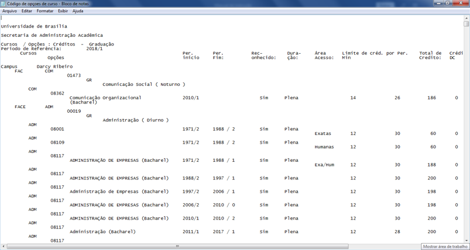

```{r setup, include=FALSE}
knitr::opts_chunk$set(echo=TRUE, eval = FALSE)
```

\pagenumbering{gobble}

\includepdf[fitpaper=TRUE, pages={1-4}]{CapaManual2.pdf} 

\pagenumbering{arabic}

\newpage
\BgThispage

# PARTE 1
## PRÉ-REQUISITOS

\newpage
Os pré-requisitos necessários para utilização do sistema estão descritos a seguir.

### 1. Programas
Para executar os códigos será necessária a instalação dos seguintes programas:

* RStudio
* wkhtmltopdf
* Rtools (na instalação, marcar a caixa "add app directory to the system path")
* PDFTk, GhostScript, and ImageMagick's convert (com a opção legacy convert.exe). Veja a Seção "Details" do help da função *nops_scan()* do *R*.

### 2. Pastas e arquivos 
Para facilitar a apresentação do sistema e auxiliar a organização dos arquivos, é necessário criar algumas pastas no computador. Este manual utilizará a disciplina Probabilidade e Estatística (PE) como referência, portanto uma pasta chamada "PE" será criada, contendo as seguintes subpastas:

i. Banco_questoes
ii. Suplementos
iii. Prova_1
    + Cadastro dos alunos

A seguir tem-se a descrição do conteúdo necessário em cada uma das subpastas citadas acima.

i. A pasta “Banco_questoes” deve conter as questões do banco em formato .Rnw e a planilha das respectivas dificuldades “matriz.dificuldades.csv” (mais detalhes desta planilha na seção 1.2.4).

ii.	A pasta “Suplementos” deve conter os seguintes arquivos:
*	"info.tex" (arquivo tex com as instruções impressas na prova para os alunos).
*	“Funcoes_Extras.R” (arquivo contendo as funções que complementam o pacote exams).
*	“Folha_branco.pdf” (arquivo pdf com folha em branco).

iii. Além disso, a pasta “Prova_1” deve conter os seguintes arquivos:
*	gerar_prova.R: arquivo utilizado na geração das provas.
*	corrigir_prova.R : arquivo utilizado na correção das provas.
*	README - P1.txt : arquivo de registro dos acontecimentos relevantes durante o processo de correção das provas.
*	Para gerar as provas da disciplina de Probabilidade e Estatística (PE), a pasta “Cadastro dos alunos” deve conter 2 arquivos com os dados atuais dos alunos matriculados em PE:
    + “Composição de Turmas PE.txt”: solicitar à secretaria do departamento.
    + “PE.txt”: solicitar à secretaria do departamento.  
Além disso, a pasta “Cadastro dos alunos” deve conter o dicionário de códigos de cursos, que não precisa ser atualizado semestralmente.
    + “Código de opçoes de curso.txt”.  
Observação: Para gerar provas de outra disciplina, a pasta “Cadastro dos alunos” pode ficar em branco nesse momento.

Segue ilustração da organização das pastas:





\newpage
\BgThispage

# PARTE 2
## GERAÇÃO DAS PROVAS

\newpage
Após concluir a etapa de pré-requisitos, o código *gerar_prova.R* pode ser executado conforme descrito a seguir.

### 1. Localizando as pastas
Execute as seguintes linhas do programa:

```{r}
### Identificando as pastas necessárias
if(length(ls()) > 0) rm(list = ls())
pasta.cadastros <- choose.dir(default=getwd(), 
                              caption="Escolha a pasta com os dados dos alunos")
pasta.provas <- choose.dir(default=getwd(), 
                           caption="Escolha a pasta onde salvar as provas")
pasta.questoes <- choose.dir(default=getwd(), 
                             caption="Escolha a pasta com o banco de questoes")
pasta.suplementos <- choose.dir(default=getwd(), 
                              caption="Escolha a pasta com os arquivos suplementares")
```

Nesse passo, o programa solicitará que o usuário indique a localização de alguns arquivos. Mais especificamente, quatro pastas precisam ser especificadas, conforme exemplificado abaixo:

*	Escolha a pasta com os dados dos alunos: \\PE\\Prova_1\\Cadastro dos alunos.
*	Escolha a pasta onde salvar as provas: \\PE\\Prova_1.
*	Escolha a pasta com o banco de questões: \\PE\\Banco_questoes.
*	Escolha a pasta com os arquivos suplementares: \\PE\\Suplementos.


### 2. Carregando as funções suplementares
Execute a seguinte linha do programa:

```{r}
### Carregando as funcoes suplementares usadas no codigo
source(paste0(pasta.suplementos, "\\Funcoes_Extras.R"))  # Complementando pacote Exams 
```

Além da estrutura presente no pacote *exams*, outras funções foram desenvolvidas para complementar o sistema de avaliação. Nessa etapa, essas funções extras serão carregadas no R.

### 3. Organizando o cadastro dos alunos
Aqui, o programa cria o cadastro dos alunos com base nos arquivos disponibilizados pela secretaria do departamento de Estatística da Universidade de Brasília. Para outras disciplinas, o usuário não precisa rodar essa seção (leia a observação de como proceder no final desse tópico).

```{r}
### Organizando o cadastro a partir dos arquivos disponibilizados pela secretaria.
cadastro <- gerar.cadastro() # Gerando um arquivo csv com o cadastro.
```

Nesse passo, o programa solicitará que o usuário indique a localização dos seguintes arquivos:

*	Arquivo .txt com os dados dos alunos: “PE.txt”.
*	Arquivo .txt com os dados dos cursos dos alunos: “Composição de Turmas PE.txt”.
*	Arquivo .txt com o dicionário de códigos de cursos: “Código de opçoes de curso.txt”.

Em seguida, na pasta “Cadastro dos alunos”, o programa vai incluir automaticamente uma planilha de alunos matriculados para cada turma e uma geral contendo informação de todas as turmas, conforme ilustrado a seguir.


Observação: Para geração de provas de outra disciplina, não é necessário rodar essa seção. No entanto, será necessário incluir na pasta "Cadastro dos alunos" as planilhas por turma “Tabela de alunos – XX.csv” seguindo o modelo acima. Além disso, deve-se combinar os dados de todas as turmas na “Tabela de alunos matriculados.csv” seguindo o mesmo modelo.

Independente da disciplina, a pasta "Cadatro dos alunos" deve conter os arquivos .csv ilustrados a seguir (e os arquivos .txt para o caso de PE).


### 4. Definindo os parâmetros da prova
Execute o código a seguir alterando os parâmetros conforme as respectivas informações da prova. 

```{r}
### Definindo os parâmetros da prova
semente <- 8768435
set.seed(semente)  # Definindo a semente do algoritmo
numero.prova <- 1 # Número da prova
nome.prova <- paste0("Prova_", numero.prova) # Nome da prova
titulo.prova <- "Prova 1"  # Titulo incluído na folha de respostas
data.prova <- "2019-09-18"  # aaaa-mm-dd
n.questoes <- 10 # Definindo o número de questões na prova 
total.pontos <- 10  # Definindo a pontuação máxima da prova
```

Aqui é essencial modificar a semente do algoritmo e as variáveis *n.questoes* (número de questões na prova) e *total.pontos* (pontuação máxima da prova). A semente é importante para garantir a reprodutividade dos resultados ao rodar novamente o código, se for necessário. 


### 5. Definindo a estrutura de questões para a prova
O banco de questões é organizado por tema, e o nome dos arquivos seguem a seguinte nomenclatura "xx_nome.tema_yy.Rnw", onde "xx" representa o número do tema e "yy" o número da questão do respectivo tema. A estrutura de questões da prova é definida nesse estágio, sendo adotada 1 questão por tema, todas com igual pontuação (em alguns casos é conveniente arredondar a pontuação das questões, para tanto um valor um pouco menor é atribuído à primeira questão da prova). Alterações nesta estrutura padrão devem ser feitas com cautela. 

```{r}
### Definindo a estrutura de questões para a prova
aux <- list.files(pasta.questoes, ".Rnw")
banco.questoes <- vector(n.questoes, mode="list")
for(questao in 1:n.questoes) {  # Uma questão por tópico
  topico <- formatC(questao + 10*(numero.prova - 1), digits=1, flag="0", format="d")
  banco.questoes[[questao]] <- aux[str_detect(aux, paste0("^", topico))]
}
```

```{r}
### Definições padrão
aux <- list.files(pasta.cadastros)  # Lendo os cadastros das turmas
cadastro.turmas <- aux[grep("Tabela de alunos - ", aux)]
turmas <- substr(cadastro.turmas, 20, 21)  # Identificando a sigla das turmas
n.turmas <- length(cadastro.turmas)  # Identificando o número de turmas
n.temas <- length(banco.questoes) # Definindo o número de temas na prova
questoes.por.tema <- rep(1, n.questoes)  # Definindo o número de questões por tema
pontos <- round(total.pontos*rep(1/n.questoes, n.questoes), 2)  # Valor da questão
pontos[1] <- round(total.pontos-sum(pontos[-1]), 2)
```

### 6. Sorteando as questões para as turmas
Rode o código a seguir.

```{r}
### Sortear as questões para as turmas
questoes.sorteadas <- sortear.questoes()
```

No sorteio das questões, será necessário selecionar o arquivo com a tabela de questões com as respectivas dificuldades “PE\\Banco_questoes\\2_2019\\Completo\\matriz.dificuldades.csv”. O arquivo contém o nome da questão, o percentual de acertos, o tamanho da amostra para o qual o percentual foi calculado (apenas para referência) e o número do tema da questão.


Observação: A função “sortear.questoes()” tem o parâmetro “prob.media” que especifica a nota média desejada, com default “prob.media=0.55”. Ao alterar essa nota, certifique-se de que as questões do banco têm um percentual de acerto compatível. As questões sorteadas serão salvas no arquivo “Questoes_sorteadas_Prova_1.csv” na pasta \\PE\\Prova_1.


### 7. Criando múltiplos exames
Aqui as provas serão geradas para cada aluno de cada turma com base nas questões sorteadas no passo 6. É possível adicionar uma (ou mais) página em branco em cada prova alterando a variável “adicionar.paginas”. Esta página adicional pode ser usada para rascunho ou com o intuito do número de páginas por prova ser par visando a impressão frente e verso.

```{r}
### criando múltiplos exames
gerar.provas(
  numero.turmas=1:n.turmas,
  adicionar.paginas=rep(1, n.turmas),
  #n.provas.turmas=rep(1, n.turmas),
  duplex=F
)
```

Caso tenha interesse em testar o código, rode essa seção desmarcando a linha  
"#n.provas.turmas=rep(1, n.turmas)".  
Dessa forma, apenas uma prova por turma será gerada. Para rodar a versão final, volte a partir do passo 4 para manter a mesma semente. 

Nessa etapa será criada uma pasta chamada “Para_impressao” com 1 arquivo pdf por turma para impressão. Além disso, para cada turma será criada uma pasta chamada “Turma_XX”, conforme ilustrado a seguir.


A pasta de cada turma contém 3 subpastas. Em “Provas” estão as provas individuais de cada aluno separadamente e em “Solucoes” estão suas respectivas resoluções (criadas com base nos arquivos .Rnw da pasta “Banco_questoes”). A pasta “Respostas” será usada posteriormente na etapa de correção das provas.


### 8. Salvando a área de trabalho
Execute o código a seguir para salvar a área de trabalho das provas geradas na pasta "\\PE\\Prova_1".

```{r}
### Salvando a área de trabalho
save.image(file=paste0(pasta.provas, "\\Area_trabalho_provas_geradas.RData"))
```

O processo de geração das provas foi concluído. Na pasta “Para_impressao” estão os arquivos que devem ser enviados para impressora. Devido ao tamanho dos arquivos, o compartilhamento pode ser realizado na nuvem, por meio de um link do $onedrive$, por exemplo.

Recomenda-se que os alunos levem seu caderno de questões ao terminar a prova, e guardem-o para acessar o resultado. No canto superior direito do caderno de questões de cada aluno há o número de identificação da prova, que é a senha de acesso do resultado na divulgação das notas. Considerando que o banco de questões é grande, não há prejuízo os alunos terem acesso a provas antigas. Além disso, a entrega do caderno de questões é importante para que os alunos confiram posteriormente a solução detalhada da sua prova, podendo inclusive reportar erro em alguma questão do banco.


\newpage
\BgThispage

# PARTE 3
## CORREÇÃO DAS PROVAS

\newpage

### 1. Instruções gerais
Além dos pré-requisitos detalhados na Parte 1 desse manual, seguem algumas instruções adicionais para o processo de correção das provas. 

As folhas de respostas escaneadas da turma XX devem ser salvas, em formato pdf, na pasta "PE\\Prova_1\\Turma_XX\\Respostas". As configurações utilizadas no escâner interferem na qualidade da leitura do material pelo software R. Após diversos testes, a configuração a seguir mostrou-se a mais adequada:

*	Nome do arquivo: Nome da turma (AA, por exemplo).
*	Cor: Preto e branco (e não em escala de cinza).
*	Resolução: 600 dpi.
*	Qualidade: Melhor.
*	Opção: Todas as provas em um único arquivo (múltiplas folhas).
*	Formato: pdf.
*	Orientação: Escanear de cabeça para baixo.
*	Claridade: 4 (na escala de 1 a 11).
*	Observações: Evitar que as páginas estejam inclinadas.

Além disso, o cuidado no preenchimento do cartão de respostas é primordial para a correta leitura dele. Os aspectos gerais mais importantes que devem ser reforçados com os alunos são:

*	O preenchimento (com caneta azul ou preta) dos campos disponíveis para a matrícula e respostas das questões deve ser realizado, exclusivamente, por meio da marcação de um "X", e não pintando os campos citados.
*	O cartão de respostas deve ser preservado, de modo que não seja amassado, dobrado, manchado ou receba outros tipos de avarias. O aluno não deve escrever no verso da folha de respostas.
*	Antes de iniciar a prova, o aluno deve conferir se o número de identificação da prova (Identidade do documento) é o mesmo na folha de respostas e no caderno de questões.

A lista completa de instruções impressas nas provas de PE está no modelo de prova anexo.

Por fim, é recomendável fazer um backup da pasta "PE\\Prova_1" antes de iniciar a correção das provas e documentar a ocorrência de problemas com a correção da prova (e o procedimento executado para correção deles) em um arquivo txt para registro ("README - P1.txt").

O código corrigir_prova.R pode ser executado conforme descrito a seguir.


### 2. Carregando os arquivos
A área de trabalho salva ao final do processo de geração das provas será carregada no ambiente de trabalho do R, além das funções complementares ao pacote *exams*.

```{r}
if(length(ls()) > 0) rm(list = ls())
setwd(choose.dir(default=getwd(), caption="Escolha a pasta onde as provas foram salvas"))
load("Area_trabalho_provas_geradas.RData")
source(paste0(pasta.suplementos, "\\Funcoes_Extras.R"))  # Complementando pacote Exams 
```

### 3. Localizando as pastas
Esta seção deve ser rodada apenas se as provas tiverem sido geradas em outro computador. Caso contrário, pular para o próximo passo.

```{r}
pasta.provas <- choose.dir(default=getwd(), 
                           caption="Escolha a pasta onde as provas foram salvas")
pasta.cadastros <- choose.dir(default=getwd(), 
                              caption="Escolha a pasta com os dados dos alunos")
pasta.suplementos <- choose.dir(default=getwd(), 
                            caption="Escolha a pasta com os arquivos suplementares")
```

Nesse passo, o programa solicitará que o usuário atualize a localização de algumas pastas.

*	Escolha a pasta onde as provas foram salvas: \\PE\\Prova_1.
*	Escolha a pasta com os dados dos alunos: \\PE\\Prova_1\\Cadastro dos alunos.
*	Escolha a pasta com os arquivos suplementares: \\PE\\Suplementos.


### 4. Digitalizando as respostas
Aqui o cartão de respostas dos alunos será digitalizado. A seguir note que a função "digitalizar.respostas()" contém a opção “rotate=T” para indicar que os arquivos foram escaneados de cabeça para baixo (caso não seja o caso, modificar para “rotate=F”). Os parâmetros “threshold” e “minrot” são critérios utilizados internamente na codificação das informações contidas nas imagens. Para imagens com boa qualidade (veja seção 1), os valores pré-definidos são satisfatórios, mas caso seja necessário alterá-los consulte o help da função *nops_scan*.

```{r}
### Juntar os metainfos das turmas em um único objeto
juntar.metainfos(pasta.provas)
metainfo <- readRDS(paste0(pasta.provas, "\\Metainfo\\metainfo.RDS"))

### Definir as turmas a serem corrigidas
corrigir.turmas <- 1:n.turmas

### Digitalizar as respostas
renomear.arquivos(pasta.provas, corrigir.turmas)
gerar.cadastros(pasta.provas, corrigir.turmas)
digitalizar.respostas(pasta.provas, corrigir.turmas, rotate=T, 
                      threshold=c(0.04, 0.6),  minrot=0.001)
```

Nesta etapa será criado um arquivo chamado “metainfo.Rds” na pasta “Metainfo”. Este arquivo contém os metadados produzidos, sendo usado internamente durante o processo de correção das provas.

Além disso, na pasta de cada turma "\\Turma_XX\\Respostas", os arquivos “Cadastro.csv” e “nops_scan_x.zip” serão criados. O primeiro contém os dados do aluno (nome, matrícula) e o número de identificação da sua prova. E o arquivo zipado contém todas as imagens (cartão de resposta) lidas pelo programa e um arquivo “Daten.txt” com as informações extraídas dessas imagens.

Neste momento é necessário abrir o arquivo “Daten.txt” e verificar se há alguma linha com a palavra “ERROR”, indicando erro de leitura em alguma prova. Utilizando as configurações do escaner apresentadas na seção 1, espera-se não haver erros de leitura aqui. Caso haja muitos, recomenda-se escanear as provas novamente. Mas caso haja algum, os dados dessa prova deverão ser inseridos manualmente.  Para tanto, abra a imagem correspondente no arquivo zipado “nops_scan_x.zip” e insira os dados na linha que apresentou erro. Para facilitar, no lugar do “ERROR”, copie e cole a linha anterior (como modelo) e altere todos os dados necessários. Note que a codificação da marcação do aluno segue a seguinte lógica: a (10000), b (01000), c (00100), d (00010), e (00001). Após as alterações, salve o arquivo “Daten.txt” e, ao fechar a janela do arquivo zipado “nops_scan_x.zip”, selecione a opção de aceitar mudanças no arquivo zip na caixa de diálogo que aparecerá.

Caso algum aluno tenha errado a marcação da folha de respostas (preenchendo todo o quadrado, por exemplo), o arquivo “Daten.txt” também pode ser alterado nesse momento para inserir manualmente as informações.

### 5. Checando as leituras
Execute o código a seguir para checar as leituras dos cartões.

```{r}
### Checar leituras em respostas onde mais de um item foi marcado
checar.leituras(pasta.provas, corrigir.turmas)
leitura.duvidosa <- leitura.correta <- procurar.erros(pasta.provas, corrigir.turmas)
fix(leitura.correta)
write.table(leitura.correta, paste0(pasta.provas, "\\leitura.correta.txt"))
corrigir.leitura(leitura.correta, pasta.provas, corrigir.turmas)
corrigir.provas(corrigir.turmas)
```

Primeiramente, as leituras serão checadas para verificar se as matrículas que os alunos preencheram estão de acordo com as matrículas registradas no cadastro dos alunos. Aqui é normal aparecer algumas discordâncias, seja porque o aluno marcou errado (mais provável), ou deixou em branco, ou o sistema não leu corretamente (pode acontecer). Em todos esses casos, para corrigir a matrícula, deve-se digitar manualmente o número correto. Para isso, digite o número de matrícula que o aluno escreveu na prova com base na imagem apresentada ao lado. Em geral, a marcação com “x” está errada, mas o número informado está correto. Caso este número também tenha sido escrito errado (raro, mas acontece), o sistema vai continuar acusando erro nessa prova, e o número de matrícula correto do aluno pode ser encontrado no cadastro com base no seu nome completo.

Essa etapa de correção das matrículas é a mais dispendiosa, por isso vale reforçar a atenção dos alunos com esse ponto para reduzir os erros.

Em seguida, as leituras serão checadas para verificar se alguma questão tem dupla marcação. Se houver, o programa vai abrir uma janela com os dados da respectiva prova para alteração manual. Lembrando que a codificação segue a seguinte lógica: a (10000), b (01000), c (00100), d (00010), e (00001). Recomenda-se abrir a imagem da prova correspondente (busque o arquivo em “nops_scan_x.zip” na pasta "Prova_1\\Turma_XX\\Respostas”) para averiguar o motivo da dupla marcação (falha do aluno ou do sistema).

Após essas correções manuais, as provas serão corrigidas e alguns gráficos gerais serão apresentados no R.

### 6. Gerando os resultados
Além das notas, cada aluno recebe um arquivo contendo a sua folha de respostas, o gabarito correto e a solução detalhada da sua prova. Este arquivo é codificado com uma senha, esta é o número de identificação da prova, que também está impressa no canto superior direito do caderno de questões de cada aluno. Lembrando que os alunos levam seu caderno de questões ao terminar a prova, e devem guardá-lo para acessar o resultado com essa senha.

```{r}
### Gerar os resultados
diretorio.resultados <- paste0(pasta.provas, "\\Resultados") 
criar.resumos(pasta.provas, diretorio.resultados, corrigir.turmas)
gerar.espelhos(pasta.provas, diretorio.resultados, corrigir.turmas)
converter.html2pdf(corrigir.turmas)  # Converter os espelhos de prova para pdf 
banco.respostas <- gerar.banco.dados(corrigir.turmas)  # Banco das respostas dos alunos
juntar.arquivos.divulgacao(corrigir.turmas)  # Juntar os arquivos para divulgação
inserir.senha.pdf(corrigir.turmas)
```

Nessa seção, o sistema faz a organização desses arquivos para apresentação do resultado da prova aos alunos. Uma pasta chamada "Resultados" é criada em "\\Prova_1\\" contendo uma planilha por turma com as notas. Além disso, na pasta "Prova_1\\Resultados\\Turma_XX", estão os arquivos de cada aluno, cujo nome é o número da matrícula e a senha é o número de identificação da prova. Esses arquivos pdf são disponibilizados no Moodle.

Considerando a estrutura da disciplina de Probabilidade e Estatística, com 3 provas e uma prova substitutiva, as menções provisórias podem ser geradas após a prova 3 rodando a linha a seguir.

```{r}
### Gerar menções provisórias
gerar.mencoes.provisorias(corrigir.turmas)
```

A função "gerar.mencoes.provisorias()" merge o resultado das 3 provas em uma única planilha e calcula a menção provisória (anterior à prova substitutiva) da disciplina de Probabilidade e Estatística. Portanto, essa função deve ser usada apenas após a correção da Prova 3.

### 7. Salvando a área de trabalho
Execute o código a seguir para salvar a área de trabalho das provas corrigidas na pasta "\\PE\\Prova_1".

```{r}
### Salvando a área de trabalho
save.image(file=paste0(pasta.provas, "\\Area_trabalho_provas_corrigidas.RData"))
```

Pronto! Agora é só disponibilizar os arquivos pdf codificados com senha aos alunos.


\newpage
\BgThispage
 
# ANEXO 1
## Exemplo de Prova

\newpage
\includepdf[fitpaper=TRUE, pages={1-6}]{imagens/Prova_1_AA_08.pdf} 


\newpage
\BgThispage
 
# ANEXO 2
## Exemplo de Resultado

\newpage
\includepdf[fitpaper=TRUE, pages={1-8}]{imagens/170170586-desbloqueado-editado.pdf} 
