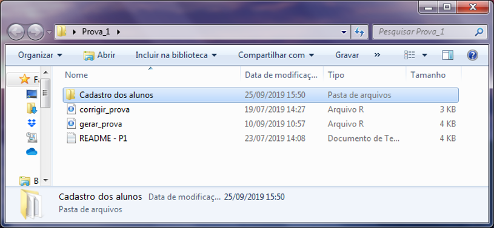
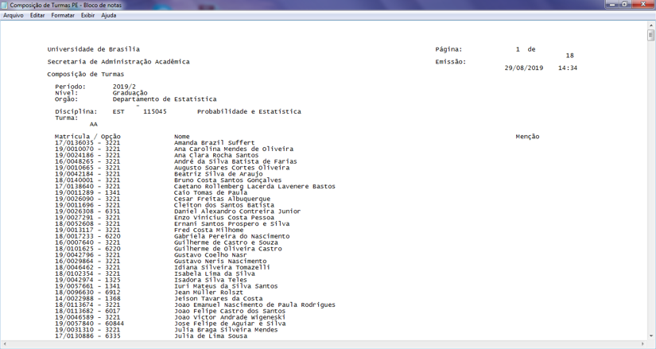
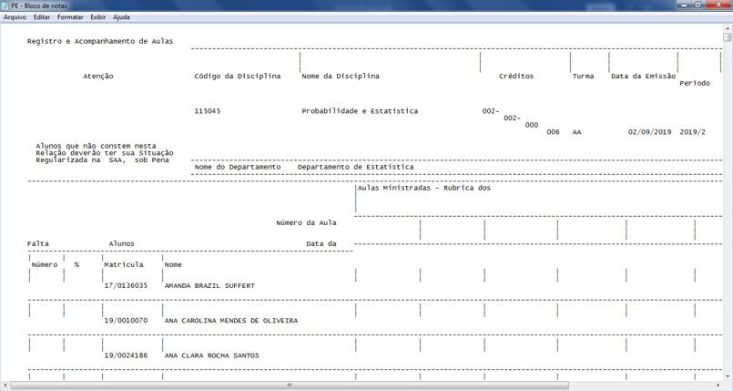
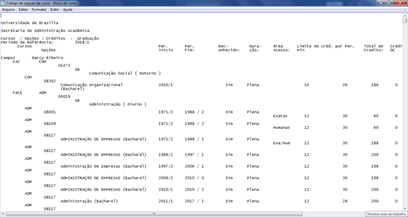
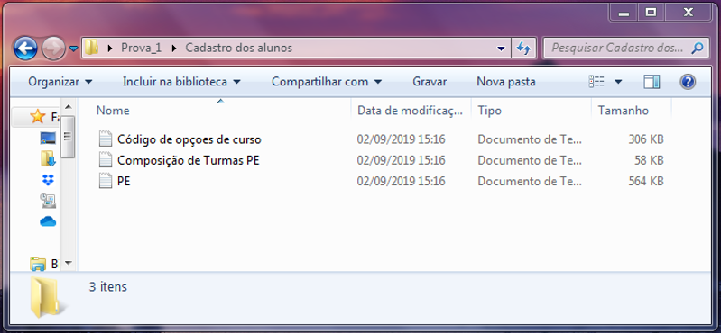
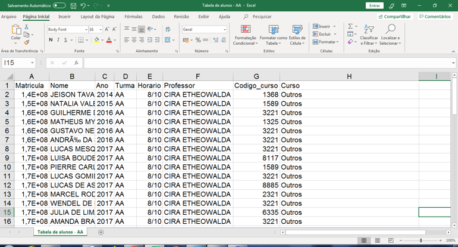
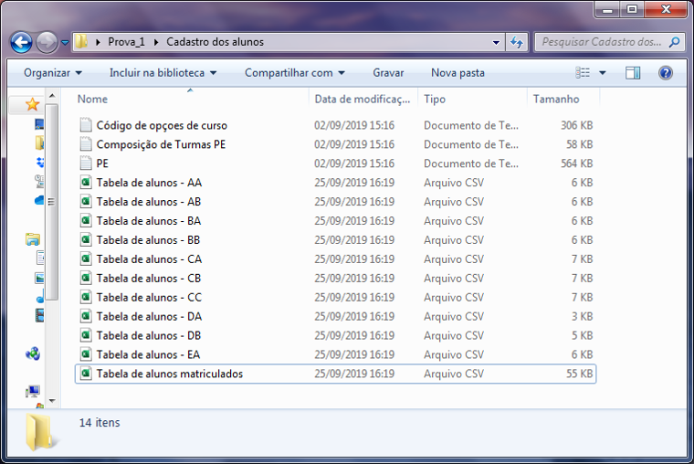
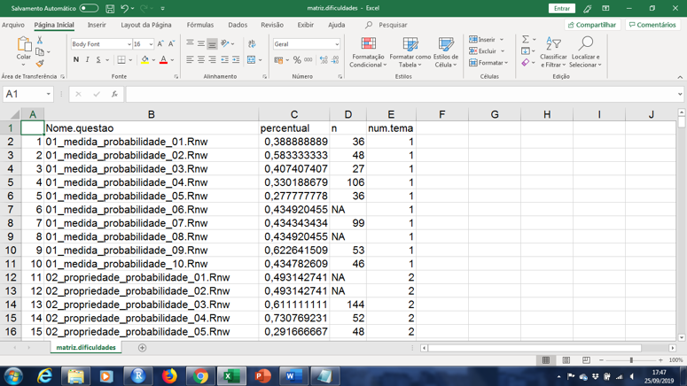
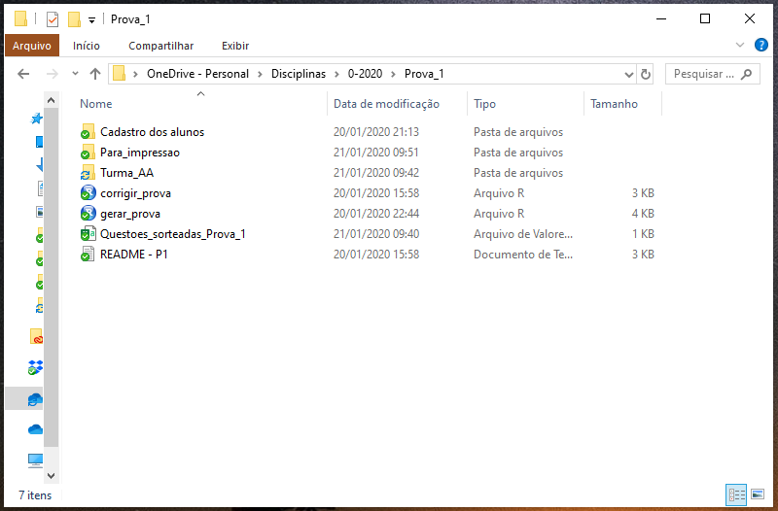
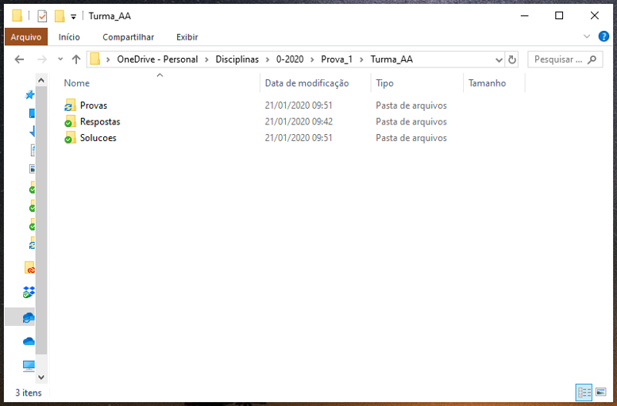

```{r message=FALSE, echo=FALSE, cache=F, results='hide', warning=FALSE, error=FALSE}
#Lendo os dados das provas e carregando os pacotes:
if(length(ls()) > 0) rm(list = ls())
knitr::opts_chunk$set(message=FALSE, echo=FALSE, cache=TRUE, 
                      results='hide', warning=FALSE, error=FALSE, autodep=TRUE)

if (!require("pacman")) install.packages("pacman")
pacman::p_load("tidyverse", "dplyr", "tidyr", "reshape2", "irtoys", "ltm", "mirt",
               "bairt", "ggplot2", "R.utils", "igraph", "factoextra", "threejs", "GGally",
               "pander", "rstan", "fmsb", "tibble", "stringr", "antaresViz", "networkD3", 
               "knitr", "kableExtra", "RColorBrewer")


tema.graficos <- theme_light() + 
  theme(plot.margin=unit(rep(.5, 4),"cm"),
        axis.title.y=element_text(margin=unit(rep(.5, 4), "cm"), size=14),
        axis.title.x=element_text(margin=unit(rep(.5, 4), "cm"), size=14),
        axis.text.y=element_text(size=14),
        axis.text.x=element_text(size=14),
        panel.border=element_rect(colour=gray(.85)),
        panel.grid.major=element_blank(),
        panel.grid.minor=element_blank(),
        panel.background=element_blank(),
        # panel.border=element_blank(),
        legend.title=element_text(size=12),
        legend.text=element_text(size=12),
        legend.margin=margin(l=20, unit='pt'),
        strip.text.x=element_text(size=14),
        strip.text.y=element_text(size=14)
  )
theme_set(tema.graficos)
```

```{r message=FALSE, echo=FALSE, results='hide', warning=FALSE, error=FALSE}
load(choose.files(multi=FALSE, 
                  caption="Escolha o arquivo com os dados do curso de PE")) # "DadosPE.RData"

# Carregando o arquivo com as funções
source(choose.files(multi=FALSE,
                    caption="Escolha o arquivo com as Funcoes suplementares"),
       encoding="UTF-8")
```


\pagenumbering{gobble}

\includepdf[fitpaper=TRUE, pages={1-4}]{CapaRelatorio.pdf} 

\pagenumbering{arabic}

\tableofcontents

\newpage
\BgThispage
\chapter{Introdução}

\newpage

O Departamento de Estatística (EST) da UnB oferece semestralmente, em média, 10 turmas de Probabilidade e Estatística, totalizando aproximadamente 500 alunos de diversos cursos da área das Ciências Exatas, incluindo Ciências Econômicas, Química, Matemática, Computação e diversas Engenharias. A partir do segundo semestre de 2017, com a unificação da disciplina aprovada na 490ª Reunião Ordinária do Colegiado do Departamento de Estatística, todos os professores passaram a adotar a mesma ementa e o mesmo sistema de avaliação, visando a padronização do curso oferecido e as vantagens decorrentes.

Para tanto, surgiu a necessidade da aplicação de provas unificadas a todos os alunos matriculados na disciplina. Obviamente, turmas de dias/horários diferentes não podiam fazer a mesma avaliação. Diante desse desafio, uma opção operacionalmente onerosa era reunir todos os alunos simultaneamente para aplicação dos exames. Algumas tentativas ocorreram aos sábados, mas foram majoritariamente frustradas por diversas razões logísticas. Tal estratégia demandava a elaboração de provas que seguiam certa padronização, mas que deveriam ser suficientemente distintas. Esse processo de elaboração e de correção manual era demasiadamente dispendioso devido ao número de turmas e de alunos envolvidos.

No momento da unificação, decidiu-se adotar provas exclusivamente objetivas, de múltipla escolha. Embora haja mérito na discussão das vantagens e desvantagens de cada tipo de prova: \emph{aberta}, \emph{fechada} ou \emph{híbrida}, intencionalmente evitamos incluir esse debate no escopo do projeto.      

Simultaneamente a esse movimento do Departamento de Estatística da UnB, e diante dos mesmos desafios aqui encontrados, um grupo de pesquisadores da Universidade de Economia e Negócios de Viena, liderados pelo Professor Achim Zeileis, criaram uma biblioteca de funções em linguagem `R`, batizada como \emph{R/Exams}, que permite a automação das fases de elaboração e correção de provas em cursos de graduação. Entre outras inúmeras funcionalidades, o pacote permite que os valores contidos no enunciado de cada questão sejam gerados aleatoriamente, de modo que cada aluno tenha uma prova específica, diferente das demais. Além do desejável efeito na redução do risco de fraudes, tal abordagem garante longevidade ao banco de questões, uma vez que não basta ao aluno decorar as respostas, mas sim dominar todos os passos necessários para se chegar à solução desejada.

A cada nova aplicação das provas no formato proposto, um valioso conjunto de dados se torna disponível, permitindo, entre outros usos, a calibração prévia do nível de dificuldade das provas, a identificação de temas de ensino com aproveitamento deficitário, a avaliação longitudinal do desempenho dos alunos, e, de maneira mais ampla, a consistência na execução do projeto pedagógico nas diversas turmas.

A necessidade dessa automação se tornou clara para a disciplina de Probabilidade e Estatística. Provas individualizadas e padronizadas se mostraram uma solução robusta para o sistema de avaliação. Todo material produzido está disponível sob consulta para outras Universidades, podendo ser aplicado diretamente em cursos de Estatística básica ou adaptado para qualquer outra disciplina com provas de múltipla escolha.


\section{Objetivos}
Este projeto modernizou e otimizou o sistema de avaliação dos alunos do curso de Probabilidade e Estatística da UnB, incluindo todas as suas fases: elaboração, impressão, aplicação, correção, divulgação e revisão das provas.

Os objetivos específicos estão elencados a seguir.

* Redução dos custos operacionais, em especial na construção e na correção das provas, por meio do reaproveitamento das questões elaboradas e da automação da correção.
* Construção de um extenso e variado banco de questões (com possível aproveitamento em outras disciplinas de Estatística básica e/ou em cursos semipresenciais ou a distância).
* Estabelecimento de metodologias de análise das respostas dos alunos, via Teoria da Resposta ao Item, para o aperfeiçoamento contínuo do sistema e da qualidade do banco de questões;
* Criação de rotinas computacionais para viabilizar e automatizar as soluções desenvolvidas ao longo do projeto (extensão do pacote \emph{R-exams});
* Elaboração de relatórios gerenciais para professores e coordenadores da disciplina (vide Capítulo \ref{cap:AnaliseTRI});
* Promoção da consistência na execução do projeto pedagógico nas diversas turmas, incluindo a equalização do nível de dificuldade das provas nas diversas turmas;
* Aumento da transparência e da agilidade na divulgação dos resultados (os alunos têm acesso ao espelho e à solução detalhada de sua prova);
* Simplificação da logística de impressão, aplicação e revisão dos exames;
* Redução do risco de fraudes;


<!-- O processo de modernização da avaliação na disciplina Probabilidade e Estatística envolveu a criação de um sistema automatizado para elaboração, correção e revisão de provas na disciplina. Em síntese, o projeto compreendeu a extensão do pacote \emph{R-exams} do software livre `R` e a elaboração de um banco de questões de Estatística básica no formato exigido por esse pacote.  -->


\section{Desenvolvimento}
O projeto contou com a participação de dois alunos bolsistas (financiados pelo Programa Aprendizagem para o 3º Milênio (A3M) da UnB) por um período de 12 meses. Ambos trabalharam na construção de um banco com 300 questões de Estatística básica no formato requerido pela ferramenta R/Exams, contendo: enunciado, funções matemáticas que geram as alternativas, descrição detalhada da solução e especificação dos procedimentos de geração dos valores aleatórios (que variam de aluno para aluno). A análise apresentada no Capítulo \ref{cap:AnaliseTRI} foi elaborada como parte de um Projeto de iniciação científica (PIBIC), financiado pela FAPDF, e de um Trabalho de Conclusão de Curso (TCC). 

O projeto teve também participação de uma equipe de professores (ver detalhes na capa), os quais contribuíram enormemente na proposição de modelos de perguntas e num rigoroso processo de revisão das questões. Além de supervisionar os alunos citados, o Professor Guilherme, coordenador do projeto, trabalhou na extensão das funcionalidades computacionais da ferramenta R/Exams, a fim de facilitar a operacionalização das provas e automatizar as atividades intermediárias inerentes ao processo.


\section{Aspectos gerais do sistema} \label{sec:sistema}
Buscando um sistema de avaliação automatizado, com provas individualizadas, a comissão de planejamento unificado da disciplina de Probabilidade e Estatística optou por adotar como ferramenta primária de avaliação o pacote computacional livre Exams (http://www.r-exams.org).

Entre as principais funcionalidade do pacote R-exams está a aleatorização dos parâmetros do enunciado das questões conforme especificação do usuário. Ou seja, números aleatórios são gerados para compor o enunciado do problema. Dessa forma, ainda que a mesma questão apareça em provas diferentes, o aluno deverá compreender todos os passos do raciocínio para chegar ao resultado correto. 

Todas as questões do banco foram elaboradas meticulosamente para permitir essa aleatorização. A especificação do procedimento de amostragem dos parâmetros é uma atividade delicada e determinante para garantir que todas as amostras gerem enunciados que sejam válidos e razoáveis. A definição das funções matemáticas que geram as alternativas também requer cuidado - caso contrário há o risco de haver alternativas iguais ou absurdas.

O processo de revisão do banco também foi igualmente importante para suprimir eventuais falhas de lógica ou de programação. Visando demonstrar a aplicabilidade do conteúdo teórico nas diversas áreas de atuação dos futuros profissionais, a contextualização do enunciado das questões foi fator primordial na construção desse material. O banco atualmente conta com 300 modelos de questão, todos eles escritos em linguagem R, versando sobre 30 tópicos de Estatística básica. Este banco pode ser utilizado em outras disciplinas de Estatística básica e está disponível sob consulta.

Além do banco de questões, o sistema conta com um arcabouço de funções em linguagem R, como extensão ao pacote R-exams, para ampliar as suas funcionalidades e facilitar a interface com o usuário. Os parâmetros que podem ser modificados para atender necessidades específicas são:

* Número de questões na prova;
* Pontuação de cada questão;
* Escolha dos tópicos (dentre 30 opções atualmente disponíveis);
* Número de turmas e quantidade de alunos em cada turma.

Quanto à estrutura de avaliação da disciplina Probabilidade e Estatística na UnB, esta é composta por 3 provas regulares (com pesos 30%, 30% e 40%) e uma prova substitutiva (abrangendo todo o conteúdo do curso) para alunos que desejem repor uma eventual prova não realizada ou queiram substituir a menor nota (entre as provas regulares). 
Cada avaliação contém 10 questões de múltipla escolha sobre 10 tópicos pré-estabelecidos. Sendo assim, para cada turma, o sistema desenvolvido sorteia 10 questões do banco (uma de cada tópico). Assim, apesar de turmas diferentes realizarem provas diferentes, a fixação dos tópicos garante uniformidade no conteúdo cobrado nas avaliações. Em princípio, também é possível sortear 10 questões diferentes (ainda uma de cada tópico) para cada aluno do curso, mas considerando a aleatorização do enunciado, essa opção foi considerada inapropriada por inviabilizar a revisão em sala das questões feitas pelos alunos da turma. 
Alternativamente, poder-se-ia garantir que não há questões que se repetem em mais de uma turma. Tal estratégia também foi considerada inoportuna por comprometer o uso da TRI, uma vez que sem questões repetidas, não seria possível comparar os resultados obtidos nas diferentes turmas.  

Após a aplicação do exame, as folhas de resposta dos discentes são escaneadas e então corrigidas automaticamente pelo sistema, o qual, ao identificar o número do documento (prova), executa a correção considerando o gabarito que lhe é próprio. Ao suspeitar de erro de marcação ou de leitura do cartão de respostas, a plataforma solicita ao operador a conferência manual dos dados.

Como subproduto do processo de correção das provas, o sistema produz resultados de forma individualizada. Mais especificamente, cada aluno recebe um documento (em formato \emph{pdf}) contendo uma cópia da sua folha de respostas, o gabarito resumido e a solução detalhada da sua prova específica. Para acessar o arquivo, disponibilizado no Moodle, o aluno usa como senha o número da prova, impresso em seu caderno de questões (que o aluno leva consigo ao final da prova). Considerando a dimensão atual do banco de dados e a aleatorização dos enunciados, não há prejuízo que os alunos tenham acesso a provas antigas. 

A avaliação do desempenho dos alunos nesse nível de riqueza e profundidade é inédita no âmbito do Departamento de Estatística da UnB, e possivelmente em toda a Universidade de Brasília.

Maiores detalhes a respeito da utilização do sistema (passo-a-passo) encontram-se no Capítulo \ref{cap:Manual}.


\section{Descrição dos produtos entregues}

Os produtos produzidos nesse projeto estão sumarizados a seguir:

**1. Banco de questões**

O banco possui 300 modelos de questões de Estatística básica, organizadas em 30 temas. Cada questão contém a descrição do procedimento amostral para geração dos parâmetros aleatórios envolvidos, o enunciado, as funções que geram as alternativas erradas e a solução detalhada da questão. 

**2. Relatório de análise dos dados (Capítulo \ref{cap:AnaliseTRI})**

Relatório com análise dos dados produzidos com a aplicação do sistema na disciplina de Probabilidade e Estatística (a partir da leitura dos cartões de respostas).

**3. Manual de utilização do sistema (Capítulo \ref{cap:Manual})**

O manual descreve detalhadamente o procedimento de geração e correção das provas utilizando o código disponível em linguagem `R`.

**4. Códigos do sistema**

Os códigos desenvolvidos estão disponíveis sob consulta.


<!-- %%%%%%%%%%%%%%%%%%%%%%%%%%%%%%%%%%%%%%%%%%%%% -->
<!-- %%% Análise de resultados -->
<!-- %%%%%%%%%%%%%%%%%%%%%%%%%%%%%%%%%%%%%%%%%%%%% -->


\newpage
\BgThispage
\chapter[Análise de resultados]{Análise de resultados \\ 2º/2019} \label{cap:AnaliseTRI}


```{r}
g_notas_curso()
g_media_provas()
for (prova in 1:3) g_radar(prova)
g_porp_p4()
g_confusao_subs()
g_nota_esperada_mediano()
# g_prob_mediano_passar()
g_correlograma()
g_rede_associacao(min.cor=0, semente=1)
g_confusao_tri()
teste.inf()
```

\newpage
A mensuração do aprendizado dos estudantes a partir da realização de testes é um aspecto fundamental do sistema educacional. O resultado dos testes fornece a professores, educadores e alunos informações de grande importância sobre o aprendizado dos discentes. Tal medida é utilizada, por exemplo, para determinar se o aluno deve ou não ser aprovado no curso. 

Tradicionalmente, pela simplicidade de sua formulação, a Teoria Clássica dos Testes (TCT) é adotada para este fim. Em resumo, nessa abordagem, entende-se que a pontuação do aluno (escore observado) corresponde à soma da pontuação esperada (resultado da \emph{habilidade latente} do aluno) e do erro amostral (que faz com que o desempenho varie caso o aluno seja hipoteticamente submetido a diversas provas sobre o mesmo conteúdo e com o mesmo nível de dificuldade). Ou seja, a nota obtida é um estimador natural da \emph{proficiência} do aluno.

A habilidade latente (um atributo mental não observável do respondente), por sua vez, resulta de diversos fatores, dentre os quais destacamos o potencial cognitivo do aluno, sua dedicação ao curso, seus métodos de estudo e a experiência em sala de aula (composição da turma, estrutura física, horário, didática adotada pelo professor, materiais didáticos utilizados, entre outros fatores). 

Recentemente, a Teoria de Resposta ao Item (TRI) vem ganhando espaço, em detrimento da Teoria Clássica dos Testes, sobretudo para testes de grande escala. De acordo com o Ministério da Educação, “No Brasil, a TRI é usada desde 1995 nas provas do Sistema Nacional de Avaliação da Educação Básica (Saeb), que mede o desempenho de estudantes do ensino fundamental e médio. Em 2009, foi usada pelo Enem com o objetivo de garantir a comparação das notas do exame daquele ano com os seguintes.” No exterior, exames como o \emph{Test of English as a foreign language} (TOEFL) adotam a TRI há mais de 50 anos. A TRI é aplicável a diversos campos das Ciências e, para além do campo educacional, se mostrou particularmente útil na Medicina e na Psicometria. 
<!-- Para uma introdução detalhada à TRI, veja Van der Linden e Hambleton (1997). -->

Os modelos de TRI buscam estimar, a partir do ajuste de modelos estatísticos, a probabilidade de um aluno responder corretamente a um item em função de suas características (habilidades) e dos atributos do próprio item. A abordagem probabilística permite que se leve em consideração, entre outros aspectos, o nível de dificuldade e o poder de discriminação do item (uma medida do quanto a probabilidade de acerto varia em função do aumento da habilidade do aluno). 

Destacamos que não há intenção de, em um futuro próximo, atribuir menção em função da habilidade estimada via TRI. Os modelos são empregados exclusivamente para a investigação de como o processo avaliativo, e em especial o banco de questões, pode ser aprimorado.

Na Seção \ref{sec:descritiva} apresentamos alguns gráficos que ilustram o desempenho dos alunos ao longo do semestre e o efeito da prova substitutiva nas menções. Depois, na Seção \ref{sec:TRI}, introduzimos o modelo de TRI adotado e apresentamos os principais resultados obtidos. Por fim, na Seção \ref{sec:conclusao}, listamos as principais conclusões e recomendações.


\section{Análise descritiva dos dados} \label{sec:descritiva}


\subsection{Desempenho dos alunos} 

A Tabela 2.1 apresenta um conjunto de estatísticas do curso. Neste estudo, apenas são contabilizados os alunos que concluíram o curso, com ou sem sucesso. As menções apresentadas não correspondem necessariamente à menção efetivamente atribuída pelo professor, o qual tem a prerrogativa de considerar outros critérios, como a entrega de listas de exercícios, a participação do aluno em sala, etc. 

A média final (`r round(tabela_resumo[n.turmas+1, 3], 1)`) foi ligeiramente superior à nota média prevista (5.5), especificada na construção dos testes pela função que amostra as questões de cada turma, conforme descrito na Subseção \ref{subsec:sorteio}. Isso se deve ao descarte das respostas dos alunos que não concluíram o curso. A nota média das diferentes turmas apresentou pequena variação, diferentemente do que era observado antes da unificação da disciplina, quando as notas médias das turmas variavam amplamente. Maior homogeneidade do resultado entre turmas também foi observada no percentual de aprovados. Entretanto, apenas `r round(tabela_resumo[n.turmas+1, 5], 1)`$\%$ dos alunos atingiram a menção máxima (SS). Cientes da dificuldade de se obter nota final igual ou superior a 9 com esse sistema de avaliação, mesmo após a prova substitutiva, os professores podem considerar outros aspectos do desempenho dos alunos com nota final próxima de 9.


```{r, results='asis', fig.pos="h"}
tabela_resumo %>%
  as.data.frame() %>%
kable("latex", longtable=T, booktabs=F, digits = c(0,0,1,1,1),
      caption="Estatísticas do curso",
      col.names = c("Turma", "Alunos", "Nota final média", 
                    "% de aprovados", "% de SS"),
      align=rep("c", 5)) %>%
           kable_styling(full_width=F, position="center", latex_options=c("repeat_header"))
```

A Figura 2.1 apresenta a nota final de cada aluno da disciplina, discriminada pelo curso do discente. Nota-se que, embora haja certa similaridade entre os cursos, o desempenho dos alunos de Engenharia Elétrica, por exemplo, é substancialmente superior ao de cursos classificados como ``Outros”. 

\begin{figure} 
\includegraphics{Notas_cursos.png} 
\caption{Notas finais por curso. Para evitar pontos sobrepostos (quando alunos de um mesmo curso apresentam a mesma nota final), os pontos foram ligeiramente descolados verticalmente (procedimento conhecido como ``jitter"). A linha preta indica a média geral de cada curso.}
\label{fig:notas_cursos}
\end{figure}


A Figura 2.2(a) indica que a Prova 2 é o exame mais difícil ao longo do semestre. Embora as notas da prova substitutiva também sejam mais baixas, cabe ressaltar que isso se deve sobretudo ao fato de que os alunos que se submetem à prova substitutiva, em geral, tiveram desempenho insatisfatório nas provas anteriores. Os painéis (b), (c) e (d) mostram o percentual de acerto de cada tópico das Provas 1, 2 e 3, respectivamente. Ao avaliá-lo com cuidado, os professores podem observar temas cujo desempenho foi superior ou inferior à média. Em que pese o resultado da prova depender em grande medida da composição da turma, temas que se apresentem atipicamente abaixo da média sugerem ao professor avaliar a necessidade de interferir na estratégia de ensino, dedicando mais tempo ao tópico, por exemplo. 

O tema sobre teste de hipóteses para a proporção teve percentual de acerto inferior a $50\%$ em todas as turmas, o que não parece razoável. Sugerimos, portanto, que se investigue as causas deste resultado para que se tome as medidas cabíveis. Caso as questões estejam inapropriadas (voltaremos a esse tema adiante), é preciso melhorar os modelos de questão. Caso contrário, será preciso buscar maneiras de aperfeiçoar o ensino nessa frente. Neste contexto, cabe ressaltar que este é normalmente o último tópico ministrado no curso. 

\begin{figure}[!h]
	\centering
  \subfloat[\footnotesize{Nota média por turmas e por prova.}]{\includegraphics[width=8cm,height=6cm]{Media_provas.png}}
	\subfloat[\footnotesize{Proporção de acertos - Prova 1.}]{\includegraphics[width=8cm,height=6cm]{g_radar_1.png}} 
	\\
	\subfloat[\footnotesize{Proporção de acertos - Prova 2.}]{\includegraphics[width=8cm,height=6cm]{g_radar_2.png}}
	\subfloat[\footnotesize{Proporção de acertos - Prova 3.}]{\includegraphics[width=8cm,height=6cm]{g_radar_3.png}}
	\caption{\small (a) Nota final média dos alunos por turma e número da prova. (b), (c) e (d) apresentam, respectivamente, o percentual de acerto por tema nas provas 1, 2 e 3. O centro da figura representa $0\%$ de acerto, enquanto a borda mais externa indica $100\%$. Questões anuladas estão representadas pela média de acerto no respectivo tema.
}
	\label{fig:notas.medias}
\end{figure}


\subsection{Prova substitutiva}

Conforme discutido na Seção \ref{sec:sistema}, os alunos são autorizados a realizar uma prova substitutiva no final do semestre, versando sobre todo o conteúdo do curso. A nota da prova substitutiva substitui a menor nota, desde que a nota final não diminua (por isso ela é conhecida como ``sub do bem”). 

A Figura 2.3 traz um resumo visual dos efeitos da prova substitutiva. Primeiramente, no painel (a), apresentamos o fluxo acumulado parcial das menções ao longo do curso. Observa-se que a mobilidade entre as menções é limitada. A menção máxima, por exemplo, é atingida quase exclusivamente por aqueles que tiveram alto desempenho desde a primeira prova. A figura (b) retrata o número de alunos com nota final nas respectivas faixas, com a cor atribuída de acordo com a participação do aluno na prova substitutiva. Ao todo, `r sum(tabela1[, 3])` fizeram a prova substitutiva, dos quais `r round(sum(tabela1[tabela[, 1]<=1, 3])/sum(tabela1[, 3])*100, 1)`$\%$ estavam reprovados. Destes, `r round(sum(tabela1[tabela[, 1]<=1 & tabela[, 2]>=2, 3])/sum(tabela1[tabela[, 1]<=1, 3])*100, 1)`$\%$ conseguiram a aprovação. 

\begin{figure} 
	\centering
  \subfloat[\footnotesize{Fluxo das menções.}]{\includegraphics[width=14cm,height=5cm]{sankey.png}}
  \\
	\subfloat[\footnotesize{Número de alunos por faixa (após a Prova 3).}]{\includegraphics[width=7.5cm,height=7.5cm]{porp_p4.pdf}}
	\subfloat[\footnotesize{Menção antes e depois da Prova substitutíva.}]{\includegraphics[width=7.5cm,height=7.5cm]{confusao_subs.pdf}}
\caption{(a) Fluxo das menções parciais acumuladas. As quatro barras verticais indicam, na ordem, as 4 provas realizadas no curso. 
Na Prova 1, temos a menção correspondente à nota da própria prova; na Prova 2, calculou-se a menção parcial acumulada a partir da média aritmética das duas primeiras notas; na Prova 3, a nota final foi definida de acordo com os pesos atribuídos na ementa; na Prova substitutiva, tem-se a menção final obtida pelo aluno. Considerou-se apenas alunos que realizaram as 3 primeiras provas. (b) Número de alunos por faixa de nota final após a Prova 3. (c) Matriz com o número de alunos por menção, dada a situação antes e depois da Prova substitutiva.}
\label{fig:notas_cursos}
\end{figure}


\section{Análise via Teoria da Resposta ao Item} \label{sec:TRI}

A simples visualização dos dados brutos já é de grande valia. Entretanto, para responder questões mais desafiadoras, lançamos mão de técnicas de modelagem estatística de dados. Entre outras vantagens, o ajuste de modelos de TRI nos permite traçar um diagnóstico mais completo do banco de questões. Enquanto o percentual de acerto nos dá indícios quanto ao nível de dificuldade da questão, ele pouco nos informa sobre a qualidade das alternativas erradas (se são facilmente descartadas por alunos de baixa habilidade) e sobre o poder discriminante do item. Além de evitar questões demasiadamente fáceis ou difíceis, queremos que a habilidade latente do aluno esteja fortemente associada à probabilidade de acerto da questão. Caso contrário podemos concluir que o item é pouco informativo para a habilidade do aluno, o que é o torna sem valor prático. O percentual bruto de acerto também não leva em consideração quais alunos responderam ao item. Se ele foi sorteado para uma turma excelente, por exemplo, um alto valor levaria à falsa impressão de que se trata de uma questão fácil. 

Nesse primeiro momento, ajustamos quatro modelos (um para cada prova), todos com a mesma estrutura, definida a seguir.
\begin{align*}
Y_{ij} & \sim \text{Ber}(p_{ij}) \\
p_{ij} & = c_j + \frac{1-c_j}{1+\exp(- (a_j\theta_i - b_j))} \\
a_j & \sim \text{Half-normal}(0, 1) \\
b_j & \sim \text{N}(0, 1) \\
c_j & \sim \text{Beta}(5, 17) \\
\theta_i & \sim \text{N}(0, 1),
\end{align*}
onde $Y_{ij}$ representa se o aluno $i$ acertou (1) ou errou (0) a questão $j$, $p_{ij}$ a probabilidade do aluno $i$ acertar a questão $j$, $c_j$ a probabilidade de acerto de um aluno sem proficiência, $a_j$ o poder discriminante da questão $j$, $b_j$ a dificuldade do item $j$ e $\theta_i$ a habilidade latente do aluno $i$.

Note que, com este conjunto de modelos, precisamos estimar $3*`r length(unique(c(mapa.questoes)))` + 3*`r nrow(notas.finais)` = `r 3*length(unique(c(mapa.questoes))) + 3*nrow(notas.finais)`$ parâmetros valendo-se das `r nrow(dados.original1)` respostas (pares alunos/questões), o que não é tarefa fácil. Para tanto, usamos o pacote \emph{RStan}, do `R`, para gerar amostras da distribuição a posteriori.

Assumimos que a aleatorização dos números nos enunciados não altera os atributos (parâmetros) das questões. Além disso, para qualquer par de questões, dada a habilidade do aluno e os parâmetros das questões, os resultados (acertou/errou) são independentes um do outro. 

\subsection{Resultados preliminares}

Um dos desafios na construção dos testes é garantir certo equilíbrio entre as turmas. Caso as provas sejam mal calibradas, a nota esperada de um dado aluno pode ser muito diferente dependendo da turma em que ele esteja matriculado. Não é razoável, por exemplo, que a nota dependa mais das questões que foram sorteadas para sua turma do que de sua proficiência. 

A Figura 2.4(a) apresenta a nota média estimada de um aluno mediano (com habilidade maior que exatamente 50% dos alunos) nas diversas turmas. Notadamente, quando se observa uma prova específica, a variação entre as turmas é apreciável. Entretanto, quando se avalia a dificuldade média nas 4 provas, conclui-se que a variação entre as turmas é bastante discreta. 

Na Figura 2.4(c), apresentamos a \emph{informação} dos testes, uma medida que indica o quanto as respostas ``desvendam" a habilidade não-observável do aluno. Além disso, tal medida esclarece em qual intervalo de habilidade as respostas são mais informativas. Se, por um lado, as turmas parecem estar bem balanceadas no que diz respeito ao nível de dificuldade das questões, por outro, percebe-se que algumas provas são menos informativas que outras. Nesses casos, mesmo que o aluno tenha respondido 40 itens ao longo do curso, a incerteza a respeito de sua proficiência será alta, prejudicando o processo avaliativo. Nesse sentido, sugerimos que, no momento do sorteio das questões, se verifique também se as provas estão igualmente informativas.

A Figura 2.4(b) compara a avaliação adotada pela ementa com o que obtemos, mantidas as quantidades de alunos em cada menção, ao ordenar os alunos pela média ponderada das habilidades estimadas. Enquanto a maior parte dos discentes não teria sua menção alterada, há diversos alunos que passariam da condição de reprovado para aprovado. 

A diferença se deve, sobretudo, a dois fatores. Primeiro, independentemente do método, há um intervalo de incerteza em torno da estimativa pontual. Por exemplo, quando o modelo estima uma habilidade igual a um, ele também entende que a habilidade poderia ser de 0.9 ou 1.1, digamos. Daí, alunos que estejam no limite das menções acabam eventualmente mudando de faixa dependendo do método adotado. A incerteza pode ser reduzida aumentando-se o número de questões, mas isso tende a aumentar os custos operacionais. De todo modo, isso vale para lembrar que o acaso é um componente não-negligenciável da nota do aluno, e que outros critérios além da nota podem ser adotados.

Segundo, na TRI leva-se em conta exatamente quais questões foram acertadas, e não apenas o número total de acertos. Por isso, o escore estimado tendo a ser maior quando o aluno acerta mais questões difíceis ou com maior poder de discriminação. Considere o seguinte exemplo. Suponha que uma das questões da prova de Estatística seja sobre técnicas de fotografia. Nesse caso, a habilidade do aluno em Estatística não alteraria a probabilidade do acerto deste item. Por isso, o modelo de TRI concluiria que o item é pouco informativo para a habilidade ($a_j \approx 0$). Daí, o acerto ou erro do item pouco alteraria a habilidade estimada pelo modelo. Entretanto, na forma corrente de avaliação, o acerto do item aumentaria em 1 a nota do aluno, da mesma forma que ocorreria com qualquer uma das outras questões da prova.


A Figura 2.5(a) apresenta o correlograma dos \emph{resíduos} do modelo (medida de discrepância entre o valor previsto pelo modelo, $p_{ij}$ e o valor observado $Y_{ij}$) por tema. Visto que o modelo assume implicitamente que $Y_{ij}|p_{ij}$ e $Y_{lm}|p_{lm}$, são independentes, para qualquer $i \neq l$ e $j \neq m$, é esperado (pelo modelo) que as correlações sejam próximas a zero. Entretanto, como a referida suposição não é plenamente válida, observa-se algumas regiões de coloração mais intensa. Note que a correlação se dá entre os resíduos, e não sobre os temas diretamente. Por isso, não se pode concluir, por exemplo, que os temas \emph{Distribuição normal} e \emph{Intervalo de confiança para a média} são independentes entre si, mas sim que a informação de quanto o modelo ``errou” no primeiro tema não está probabilisticamente associado ao quanto o modelo irá errar no segundo tema.

Baseado no correlograma, construímos uma rede de associação entre os resíduos. O resultado está disponível na Figura 2.5(b). Os temas da Prova 1 estão separados por uma linha imaginária dos temas da Prova 3, indicando que, para essas provas, os temas estão mais relacionados entre si. Cabe esclarecer, entretanto, que a distância entre os pontos não corresponde exatamente ao valor da correlação do par.

As questões do tema \emph{Estimação de máxima verossimilhança} sabidamente envolvem procedimentos e entendimentos de certo modo descolados dos demais temas da Prova. No entanto, o mesmo não pode ser dito sobre o tema de \emph{Teste de hipóteses para a proporção}. Por isso, novamente sugerimos que se investigue as os motivos que tornaram o comportamento desse tema contraintuitivo.

\begin{figure} 
	\centering
	\subfloat[\footnotesize{Nota esperada de um aluno mediano.}]{\includegraphics[width=7.5cm, height=7.5cm]{nota_esperada.pdf}}
	\subfloat[\footnotesize{Avaliação via teoria clássixa x TRI.}]{\includegraphics[width=7.5cm, height=7.5cm]{confusao_TRI.pdf}}
	\\
	\subfloat[\footnotesize{Informação do teste.}]{\includegraphics[width=15cm, height=7cm]{teste.inf.pdf}}
\caption{(a) Nota esperada de um aluno com habilidade mediana (isso é, com $\theta=0$). (b) Número de alunos em cada menção, calculando-a com base na nota final observada (menção real) e na habilidade final estimada via TRI (definida como a média ponderada das habilidades estimadas nas provas, usando-se os mesmos pesos e protocolos da prova substitutiva). Para as menções via TRI, ordenamos e dividimos os alunos de modo a manter os percentuais observado nas menções reais. (c) Informação do teste por turma e por número da prova.}
\label{fig:Diversos.TRI}
\end{figure}


\begin{figure} 
	\centering
  \subfloat[\footnotesize{Correlograma dos resíduos por tema.}]{\includegraphics[width=16.5cm, height=9cm]{correlograma.pdf}}
  \\
	\subfloat[\footnotesize{Grafo de associação dos resíduos.}]{\includegraphics[width=15cm, height=12cm]{rede.png}}
\caption{(a) Correlograma (de Pearson) dos \emph{resíduos componente do desvio} (RCD) por tema. Valores negativos foram substituídos por zero. (b) Rede de associação dos resíduos por tema.}
\label{fig:Correlacao}
\end{figure}


\subsection{Avaliação das questões} \label{subsec:banco}

Nesta seção, apresentamos um estudo da qualidade das questões, de acordo com o ajuste via TRI. 

A figura 2.6 nos indica a probabilidade de um aluno mediano acertar cada questão aplicada durante o semestre. Temas com maior variabilidade entre as probabilidades são justamente aqueles em que os modelos de questão são mais heterogêneos. 

As questões de alguns temas são notadamente mais fáceis. Por exemplo, na Prova 1, percebe-se que os pontos referentes ao tema \emph{lei da probabilidade total} etão mais à direita, o que era de se esperar. Na Prova 3, os temas mais fáceis são os que tratam de tamanho da amostra e intervalo de confiança calculados a partir da tabela da distribuição Normal. Nesses casos, mesmo que o aluno não entenda plenamente os conceitos estatísticos, ele poderia acertar as questões desde de que identificasse corretamente a formula que deveria aplicar. Conforme visto anteriormente, o tema \emph{Teste de hipóteses para a proporção} foi o mais difícil. Entre as possíveis explicações está o nível de dificuldade das questões, o fato de este ser o último tema ministrado no curso ou alguma deficiência no processo de ensino. Os dados apresentados neste gráfico também estão disponíveis nas tabelas do Apêndice \ref{sec:tabelas}.

As Figuras 2.7 a 2.9 representam as curvas características das questões aplicadas nas provas 1 a 3. Quando a probabilidade de acerto do aluno mais habilidoso (habilidade=3) é inferior a 0.8 ou a probabilidade de acerto do aluno menos habilidoso (habilidade=-3) é superior a 0.4, sugerimos que a questão seja revisada. Tais questões estão representadas por linhas tracejadas. A leitura cuidadosa das cursvas características indicam a origem do problema. Se a curva apresentar pouca variação, o item não está fortemente associado à habilidade do aluno (o parametro $a$ é baixo). Se ela começar de uma posição elevada, um aluno pouco proficiente é capaz de deduzir a resposta correta com probabilidade alta. Por fim, quando a curva parece estar horizontalmente deslocada para direita (esquerda), a questão é muito fácil (difícil). 

Na tabela 2.2, identificamos as questões que devem ser revisadas. A tabela completa (com todas as questões aplicadas) está disponível no Apêndice \ref{sec:tabelas}.

```{r, fig.cap='Probabilidade de um aluno mediano (habilidade igual a zero) responder corretamente cada questão do banco que tenha sido sorteada a pelo menos uma das turmas nas provas 1 a 3.', fig.height=9, fig.width=7, fig.pos="H"}
g_Pm.probs.means()
```

```{r , fig.cap="Curva característica dos itens (indica a probabilidade de um aluno com dada habilidade acertar ao respectivo item) da Prova 1." ,error=FALSE,fig.height=9,fig.width=7}
cci.plot(1)
```

```{r, fig.cap="Curva característica dos itens (indica a probabilidade de um aluno com dada habilidade acertar ao respectivo item) da Prova 2.", error=FALSE,fig.height=9,fig.width=7}
cci.plot(2)
```

```{r, fig.cap="Curva característica dos itens (indica a probabilidade de um aluno com dada habilidade acertar ao respectivo item) da Prova 3.", error=FALSE,fig.height=9,fig.width=7}
cci.plot(3)
```

\newpage
```{r, results='asis', echo=F, eval=T}
  aux <- cci %>%
  filter(Revisar == "Sim") %>%
  dplyr::select(tema, questao) %>%
  unique() %>%
  semi_join(itens, .) %>%
    mutate(p1=prob_menor*100,
           p2=Prob*100, 
           p3=prob_maior*100) %>%
    rename(Tema=tema, Q=questao) %>%
    dplyr::select(-prova, -Prob, -prob_menor, -prob_maior, -n.tema)
  print(
    kable_styling(
    kable(aux, "latex", longtable=T, booktabs=F, 
      caption="Parâmetros das questão a revisar.  
      n:número de respondentes; p1, p2 e p3: probabilidade de acerto de um aluno com habilidade -3 (mínima), 0 (mediana) e 3 (máxima).",
      align=c("l", rep("c",9)), digits = c(0,0,1,1,2,0,0,0,0,0)),
           full_width=F, position="center", latex_options=c("repeat_header"),
      repeat_header_text=" (continuação)")
    )
```

\section{Conclusões, recomendações e trabalhos futuros} \label{sec:conclusao}

Neste capítulo investigamos em detalhes o desempenho dos alunos e a qualidade das questões criadas nesse projeto. Para tanto, usamos a Teoria de Resposta ao item, o que, no limite do nosso conhecimento, ainda não havia sido empregada para auxiliar a gestão do processo avaliativo em cursos oferecidos pela UnB.

O percentual de aprovação está compatível com o observado historicamente em disciplinas em cursos de Ciências Exatas. A variação entre turmas, por sua vez, teve uma redução substancial depois da unificação do curso (a análise dos dados históricos poderá ser oportunamente incluída nesse relatório). 

O percentual de alunos com menção máxima, SS, sem considerar possíveis ajustes ou arredondamentos, se mostrou demasiadamente baixo, o que sugere a adoção de medidas que o aumentem. 

Ao avaliar os dados da prova substitutiva, observamos que `r round(sum(tabela1[tabela[, 1]<=1, 3])/sum(tabela1[, 3])*100, 1)`$\%$ dos alunos que a fizeram estavam reprovados. Destes, `r round(sum(tabela1[tabela[, 1]<=1 & tabela[, 2]>=2, 3])/sum(tabela1[tabela[, 1]<=1, 3])*100, 1)`$\%$ lograram aprovação. Apenas `r tabela1[tabela1[, 1]==4 & tabela1[, 2]==5, 3]` aluno conseguiu chegar ao SS após a prova substitutiva.

Independentemente do método de avaliação (clássico ou via TRI), é preciso considerar o componente aleatório dos testes. A título de ilustração, um aluno com 8.8, submetido a outra prova, poderia, por mero acaso, alcançar 9.2. 

Apresentamos gráficos que permitem ao professor identificar temas em que os alunos tiveram desempenho deficitário. Tal informação é útil para o planejamento do curso no próximo semestre.

Os dados indicam que, pelo procedimento de sorteio das questões para as turmas, as provas estão bem equilibradas em relação ao nível de dificuldade, mas não quanto ao nível de \emph{informação}. Nesse sentido, sugerimos que se sorteie as questões de modo que o nível de informação dos testes seja parecido em todas as turmas.

Conforme detalhado na subseção \ref{subsec:banco}, diversas questões deverão ser revisadas, seja por estarem descalibradas no nível de dificuldade, por serem pouco informativas ou por conterem alternativas falsas facilmente detectáveis. 

A análise via TRI pode ser aprimorada de diversas maneiras. Por exemplo, ao invés de considerar um modelo independente por prova, seria preferível ajustar um único modelo capaz de acomodar a natureza temporal dos dados. Canalizar a distribuição a posteriori dos parâmetros das questões do semestre anterior para especificar a priori dos parâmetros no semestre corrente traria ganhos ao modelo. Em outras palavras, se em um dado semestre constatarmos que determinado item é difícil, devemos nos valer dessa informação para melhorar a precisão de nossas inferências.


<!-- %%%%%%%%%%%%%%%%%%%%%%%%%%%%%%%%%%%%%%%%%%%%% -->
<!-- %%% Manual de procedimentos -->
<!-- %%%%%%%%%%%%%%%%%%%%%%%%%%%%%%%%%%%%%%%%%%%%% -->

\newpage
\BgThispage
\chapter{Manual de procedimentos} \label{cap:Manual}

```{r include=TRUE, eval=TRUE, cache=FALSE}
knitr::opts_chunk$set(echo=TRUE, eval=FALSE)
```

\newpage

Este capítulo descreve o passo-a-passo necessário para gerar e corrigir provas de uma disciplina utilizando o sistema elaborado. Este foi desenvolvido para uso no Windows, e NÃO funciona no macOS. Para usá-las em outro sistema operacional, é preciso editar os códigos R. Para correta utilização do produto, é necessário que o usuário tenha noções básicas de `R`. A disciplina de Probabilidade e Estatística (PE) será usada como referência para facilitar a exposição dos passos, mas o sistema também pode ser aplicado a outras disciplinas, conforme detalhado nas próximas seções.

\section{Pré-requisitos} \label{sec:requisitos}
Os pré-requisitos necessários para utilização do sistema estão descritos a seguir.

\subsection{Programas}
Para executar os códigos será necessária a instalação dos seguintes programas (todos de livre acesso):

* RStudio (versão utilizada: 3.5.1);
* Pacote R exams (versão utilizada: 2.3-2);
* wkhtmltopdf (versão utilizada: 0.12.5);
* Rtools (versão utilizada: Rtools version 3.5.0.4. Na instalação, marcar a caixa "add app directory to the system path");
* PDFTk (versão utilizada: 2.0.2);
* GhostScript (versão utilizada: 9.50);
* ImageMagick's convert (com a opção legacy convert.exe). Veja a Seção "Details" do help da função *nops_scan()* do `R`.

\subsection{Pastas e arquivos} 
Para facilitar a apresentação do sistema e auxiliar a organização dos arquivos, é necessário criar algumas pastas no computador. Este manual utilizará a disciplina Probabilidade e Estatística (PE) como referência, portanto uma pasta chamada "PE" será criada, contendo as seguintes subpastas:

i. Banco_questoes
ii. Suplementos
iii. Prova_1
    + Cadastro dos alunos

A seguir tem-se a descrição do conteúdo necessário em cada uma das subpastas citadas acima.

i. A pasta “Banco_questoes” deve conter as questões do banco em formato .Rnw e a planilha das respectivas dificuldades “matriz.dificuldades.csv” (mais detalhes desta planilha na seção 1.2.4).

ii.	A pasta “Suplementos” deve conter os seguintes arquivos:
*	"info.tex" (arquivo \emph{.tex} com as instruções impressas na contracapa da prova).
*	“Funcoes_Extras.R” (arquivo contendo as funções que complementam o pacote \emph{exams}).
*	“Folha_branco.pdf” (arquivo pdf com apenas uma folha em branco).

iii. Além disso, a pasta “Prova_1” deve conter os seguintes arquivos:
*	gerar_prova.R: arquivo utilizado na geração das provas.
*	corrigir_prova.R : arquivo utilizado na correção das provas.
*	README - P1.txt : arquivo de registro dos acontecimentos relevantes durante o processo de correção das provas.
*	Para gerar as provas da disciplina de Probabilidade e Estatística (PE) na UnB, a pasta “Cadastro dos alunos” deve conter 2 arquivos com os dados atuais dos alunos matriculados em PE:
    + “Composição de Turmas PE.txt”: solicitar à secretaria do departamento.
    + “PE.txt”: solicitar à secretaria do departamento.  
Além disso, a pasta “Cadastro dos alunos” deve conter o dicionário de códigos de cursos, que não precisa ser atualizado semestralmente.
    + “Código de opçoes de curso.txt”.  
Observação: Para gerar provas em outras instituições, a pasta “Cadastro dos alunos” pode ficar em branco nesse momento.
\red{Atenção!} Os 3 arquivos devem estar salvos com o encoding UTF-8.

Segue ilustração da organização das pastas:











\section{Geração das provas}

Após concluir a etapa de pré-requisitos, o código *gerar_prova.R* pode ser executado conforme descrito a seguir.

\subsection{Localizando as pastas}
Execute as seguintes linhas do programa:

```{r}
### Identificando as pastas necessárias
if(length(ls()) > 0) rm(list = ls()) # Limpando a área de trabalho
pasta.cadastros <- choose.dir(default=getwd(), 
                              caption="Escolha a pasta com os dados dos alunos")
pasta.provas <- choose.dir(default=getwd(), 
                           caption="Escolha a pasta onde salvar as provas")
pasta.questoes <- choose.dir(default=getwd(), 
                             caption="Escolha a pasta com o banco de questoes")
pasta.suplementos <- choose.dir(default=getwd(), 
                              caption="Escolha a pasta com os arquivos suplementares")
```

Nesse passo, o programa solicitará que o usuário indique a localização de alguns arquivos. Mais especificamente, quatro pastas precisam ser especificadas, conforme exemplificado abaixo:

*	Escolha a pasta com os dados dos alunos: \\PE\\Prova_1\\Cadastro dos alunos.
*	Escolha a pasta onde salvar as provas: \\PE\\Prova_1.
*	Escolha a pasta com o banco de questões: \\PE\\Banco_questoes.
*	Escolha a pasta com os arquivos suplementares: \\PE\\Suplementos.


\subsection{Carregando as funções suplementares}
Execute a seguinte linha do programa:

```{r}
### Carregando as funcoes suplementares usadas no codigo
source(paste0(pasta.suplementos, "\\Funcoes_Extras.R"))  # Complementando pacote Exams 
```

Além da estrutura presente no pacote *exams*, outras funções foram desenvolvidas para complementar o sistema de avaliação. Nessa etapa, essas funções extras serão carregadas no R.

\subsection{Organizando o cadastro dos alunos}
Aqui, o programa cria o cadastro dos alunos com base nos arquivos disponibilizados pela secretaria do departamento de Estatística da Universidade de Brasília. Em outras instituições, o usuário não precisa rodar essa seção (leia a observação de como proceder no final desse tópico).

```{r}
### Organizando o cadastro a partir dos arquivos disponibilizados pela secretaria.
cadastro <- gerar.cadastro() # Gerando um arquivo csv com o cadastro.
```

Nesse passo, o programa solicitará que o usuário indique a localização dos seguintes arquivos:

*	Arquivo .txt com os dados dos alunos: “PE.txt”.
*	Arquivo .txt com os dados dos cursos dos alunos: “Composição de Turmas PE.txt”.
*	Arquivo .txt com o dicionário de códigos de cursos: “Código de opçoes de curso.txt”.

O comando acima irá incluir automaticamente na pasta “Cadastro dos alunos” uma planilha de alunos matriculados para cada turma e uma planilha contendo informação de todas as turmas, conforme ilustrado a seguir.



Observação: Para geração de provas em outras universidades, não é necessário rodar essa seção. No entanto, será necessário incluir na pasta "Cadastro dos alunos" as planilhas por turma “Tabela de alunos – XX.csv” seguindo o modelo acima e exatamente essa nomenclatura dos arquivos. Além disso, deve-se combinar os dados de todas as turmas na “Tabela de alunos matriculados.csv” seguindo o mesmo modelo. A pasta "Cadastro dos alunos" deve conter os arquivos \emph{.csv} ilustrados na figura a seguir (e os arquivos .txt para o caso de PE). Novamente, lembre-se de salvar os arquivos usando o encoding UTF-8.



\subsection{Definindo os parâmetros da prova}
Execute o código a seguir alterando os parâmetros conforme as respectivas informações da prova. 

```{r}
### Definindo os parâmetros da prova
semente <- 8768435  # Por segurança, trocar esse número a cada aplicação
set.seed(semente)  # Definindo a semente do algoritmo
numero.prova <- 1  # Número da prova
nome.prova <- paste0("Prova_", numero.prova)  # Nome da prova
titulo.prova <- paste("Prova", numero.prova)  # Titulo incluído na folha de respostas
data.prova <- "2019-09-18"  # aaaa-mm-dd
n.questoes <- 10  # Definindo o número de questões na prova 
total.pontos <- 10   # Definindo a pontuação máxima da prova
```

Aqui é essencial modificar a semente do algoritmo a cada nova aplicação de prova. A semente é importante para garantir a reprodutividade dos resultados ao rodar novamente o código, se for necessário. Além disso, o uso de uma semente repetida ou previsível poderia, em casos extremos, colocar em risco o sigilo da prova.


\subsection{Definindo os temas da prova}
O banco de questões é organizado por tema, e o nome dos arquivos seguem a seguinte nomenclatura "xx_nome.tema_yy.Rnw", onde "xx" representa o número do tema e "yy" o número da questão do respectivo tema. A estrutura de questões da prova é definida nesse estágio, sendo adotada 1 questão por tema, todas com igual pontuação (a primeira questão pode ter sua pontuação ligeiramente alterada para garantir que a soma dos pontos seja exatamente igual ao valor previamente definido). Alterações nesta estrutura padrão devem ser feitas com cautela. 

```{r}
### Definindo os temas da prova
aux <- list.files(pasta.questoes, ".Rnw")
banco.questoes <- vector(n.questoes, mode="list")
for(questao in 1:n.questoes) {  # Uma questão por tópico
  topico <- formatC(questao + 10*(numero.prova - 1), digits=1, flag="0", format="d")
  banco.questoes[[questao]] <- aux[str_detect(aux, paste0("^", topico))]
}
```

```{r}
### Definições padrão
aux <- list.files(pasta.cadastros)  # Lendo os cadastros das turmas
cadastro.turmas <- aux[grep("Tabela de alunos - ", aux)]
turmas <- substr(cadastro.turmas, 20, 21)  # Identificando a sigla das turmas
n.turmas <- length(cadastro.turmas)  # Identificando o número de turmas
n.temas <- length(banco.questoes) # Definindo o número de temas na prova
questoes.por.tema <- rep(1, n.questoes)  # Definindo o número de questões por tema
pontos <- round(total.pontos*rep(1/n.questoes, n.questoes), 2)  # Valor da questão
pontos[1] <- round(total.pontos-sum(pontos[-1]), 2)
```

\subsection{Sorteando as questões para as turmas} \label{subsec:sorteio}
Rode o código a seguir.

```{r}
### Sortear as questões para as turmas
questoes.sorteadas <- sortear.questoes()
```

No sorteio das questões, será necessário selecionar o arquivo com a tabela de questões com as respectivas dificuldades “PE\\Banco_questoes\\2_2019\\Completo\\matriz.dificuldades.csv”. O arquivo contém o nome da questão, o percentual de acertos, o tamanho da amostra para o qual o percentual foi calculado (apenas para referência) e o número do tema da questão.




Observação: A função “sortear.questoes()” tem o parâmetro “prob.media” que especifica a nota média desejada, com default “prob.media=0.55”. Ao alterar essa nota, certifique-se de que as questões do banco têm um percentual de acerto compatível. Embora esse parâmetro possa ser usado para aumentar ou diminuir a probabilidade de seleção de cada questão com base em seu nível de dificuldade, recomendamos cautela na definição desse valor. Grandes alterações desse parâmetro, para mais ou para menos, poderiam resultar em provas desconfortavelmente parecidas entre as turmas.
As questões sorteadas serão salvas no arquivo “Questoes_sorteadas_Prova_1.csv” na pasta \\PE\\Prova_1. 


\subsection{Criando múltiplos exames}
Aqui as provas serão geradas para cada aluno de cada turma com base nas questões sorteadas no passo 6. É possível adicionar uma (ou mais) página em branco em cada prova alterando a variável “adicionar.paginas”. Esta página adicional pode ser usada para rascunho.


```{r}
### criando múltiplos exames
gerar.provas(
  numero.turmas=1:n.turmas,
  adicionar.paginas=rep(1, n.turmas),
  #n.provas.turmas=rep(1, n.turmas),
  duplex=F
)
```

Caso tenha interesse em testar uma versão preliminar do código, rode essa seção desmarcando a linha  
"#n.provas.turmas=rep(1, n.turmas)", fazendo com que apenas uma prova seja gerada em cada turma.  
Para rodar a versão final, volte a partir do passo 4 para manter a mesma semente. 

Nessa etapa será criada uma pasta chamada “Para_impressao” com 1 arquivo pdf por turma para impressão. Para facilitar a impressão frente e verso, a função verifica se a capa de alguma das provas aparece em uma página par. Em caso afirmativo, a função adiciona automaticamente uma página em branco de modo a garantir que nenhuma uma folha conterá páginas de provas distintas.

Além disso, para cada turma será criada uma pasta chamada “Turma_XX”, conforme ilustrado na figura a seguir.



A pasta de cada turma contém 3 subpastas. Em “Provas” estão as provas individuais de cada aluno separadamente e em “Solucoes” estão suas respectivas resoluções (criadas com base nos arquivos .Rnw da pasta “Banco_questoes”). A pasta “Respostas” será usada posteriormente na etapa de correção das provas.




\subsection{Salvando a área de trabalho}
Execute o código a seguir para salvar a área de trabalho das provas geradas na pasta "\\PE\\Prova_1".

```{r}
### Salvando a área de trabalho
save.image(file=paste0(pasta.provas, "\\Area_trabalho_provas_geradas.RData"))
```

O processo de geração das provas foi concluído. Na pasta “Para_impressao” estão os arquivos que devem ser enviados para impressora. Devido ao tamanho dos arquivos, o compartilhamento pode ser realizado na nuvem, por meio de um link do $dropbox$, por exemplo.

\subsection{Considerações finais}

Após a impressão dos arquivos, o caderno de questões de cada aluno é grampeado e a ele anexamos a folha de resposta utilizando um clips para não ser amassada. Adicionalmente, entregamos ao aluno uma folha com o formulário, cujo modelo encontra-se em anexo, e uma folha contendo as tabelas das distribuições Normal e t-student. O formulário e as tabelas compõem o chamado kit prova, documentos que são impressos apenas uma vez no semestre e recolhidos e guardados após cada avaliação. Aos alunos orientamos não escrever nada no kit prova, pois o kit é reaproveitado inúmeras vezes para reduzir os custos de impressão.

Os alunos são orientados a levarem seu caderno de questões ao terminar a prova, e guardá-lo para acessar o resultado. No canto superior direito do caderno de questões de cada aluno há o número de identificação da prova, que é a senha de acesso do resultado na divulgação das notas. Considerando que o banco de questões é grande, não há prejuízo os alunos terem acesso a provas antigas. Além disso, a entrega do caderno de questões é importante para que os alunos confiram posteriormente a solução detalhada da sua prova, podendo inclusive reportar erro em alguma questão do banco.

O código para gerar as provas substitutivas é ligeiramente diferente do apresentado aqui. No item 3.2.7, adicionamos a variável “n.provas.turmas” com um vetor contendo o número de alunos por turma que irão realizar a prova substitutiva. Os alunos que desejam fazer essa avaliação respondem a um questionário pelo Moodle demonstrando seu interesse, e assim também reduzimos os custos de impressão. Além disso, no item 3.2.5, é possível definir os temas que serão cobrados alterando a variável “banco.questoes”, conforme ilustração a seguir:

```{r}
banco.questoes <- list(
  # Módulo 1
  aux[str_detect(aux, "^04_")], # Tema 4
  aux[str_detect(aux, "^06_")], # Tema 6
  aux[str_detect(aux, "^08_")], # Tema 8
  # Módulo 2
  aux[str_detect(aux, "^1[1-3]_")], # Tema 11, 12 ou 13
  aux[str_detect(aux, "^14_")], # Tema 14
  aux[str_detect(aux, "^18_")], # Tema 18
  aux[str_detect(aux, "^19|20_")], # Tema 19 ou 20 
  # Módulo 3
  aux[str_detect(aux, "^2[2-4]_")], # Tema 22 ou 24
  aux[str_detect(aux, "^2[5-7]_")], # Tema 25 ou 27
  aux[str_detect(aux, "^28|29|30_")] # Tema 28, 29 ou 30
)
```


\section{Correção das provas}


\subsection{Instruções gerais} \label{subsec:configuracoes}
Além dos pré-requisitos detalhados na Seção \ref{sec:requisitos}, seguem algumas instruções adicionais para o processo de correção das provas. 

As folhas de respostas escaneadas da turma XX devem ser salvas, em formato pdf, na pasta "PE\\Prova_1\\Turma_XX\\Respostas". As configurações utilizadas no escâner interferem fortemente na qualidade da leitura dos documentos pelo pacote \emph{exams}. Após diversos testes, a configuração a seguir mostrou-se a mais adequada, reduzindo o número de erros de leitura e o tamanho dos arquivos gerados.

*	Nome do arquivo: Nome da turma (AA, por exemplo).
*	Cor: Preto e branco (e não em escala de cinza).
*	Resolução: 600 dpi.
*	Qualidade: Melhor.
*	Opção: Todas as provas em um único arquivo (múltiplas folhas).
*	Formato: pdf.
*	Orientação: Escanear de cabeça para baixo.
*	Claridade: 4 (na escala de 1 a 11).
*	Observações: Evitar que as páginas estejam inclinadas.


Além disso, o cuidado no preenchimento do cartão de respostas é primordial para a correta leitura dele. Os aspectos gerais mais importantes que devem ser reforçados com os alunos são:

*	O preenchimento (com caneta azul ou preta) dos campos disponíveis para a matrícula e respostas das questões deve ser realizado, exclusivamente, por meio da marcação de um "X", e não pintando os campos citados.
*	O cartão de respostas deve ser preservado, de modo que não seja amassado, dobrado, manchado ou receba outros tipos de avarias. O aluno não deve escrever no verso da folha de respostas.
*	Antes de iniciar a prova, o aluno deve conferir se o número de identificação da prova (Identidade do documento) é o mesmo na folha de respostas e no caderno de questões.

A lista completa de instruções impressas nas provas de PE está no modelo de prova apresentada no apêndice.

Por fim, é recomendável fazer um backup da pasta "PE\\Prova_1" antes de iniciar a correção das provas e documentar a ocorrência de problemas durante a correção (e o procedimento executado para correção deles) em um arquivo txt para registro ("README - P1.txt").

O código `corrigir_prova.R` pode ser executado conforme descrito a seguir.


\subsection{Carregando os arquivos}
A área de trabalho salva ao final do processo de geração das provas será carregada no ambiente de trabalho do R, além das funções complementares ao pacote *exams*.

```{r}
if(length(ls()) > 0) rm(list = ls())
setwd(choose.dir(default=getwd(), caption="Escolha a pasta onde as provas foram salvas"))
load("Area_trabalho_provas_geradas.RData")
source(paste0(pasta.suplementos, "\\Funcoes_Extras.R"))  # Complementando pacote Exams 
```

\subsection{Localizando as pastas}
Esta seção deve ser rodada apenas se as provas tiverem sido geradas em outro computador. Caso contrário, pular para o próximo passo.

```{r}
pasta.provas <- choose.dir(default=getwd(), 
                           caption="Escolha a pasta onde as provas foram salvas")
pasta.cadastros <- choose.dir(default=getwd(), 
                              caption="Escolha a pasta com os dados dos alunos")
pasta.suplementos <- choose.dir(default=getwd(), 
                            caption="Escolha a pasta com os arquivos suplementares")
```

Nesse passo, o programa solicitará que o usuário atualize a localização de algumas pastas.

*	Escolha a pasta onde as provas foram salvas: \\PE\\Prova_1.
*	Escolha a pasta com os dados dos alunos: \\PE\\Prova_1\\Cadastro dos alunos.
*	Escolha a pasta com os arquivos suplementares: \\PE\\Suplementos.


\subsection{Digitalizando as respostas}
Aqui o cartão de respostas dos alunos será digitalizado. A seguir note que a função "digitalizar.respostas()" contém a opção “rotate=T” para indicar que os arquivos foram escaneados de cabeça para baixo (caso não seja o caso, modificar para “rotate=F”). Os parâmetros “threshold” e “minrot” são critérios utilizados internamente na codificação das informações contidas nas imagens. Para imagens com boa qualidade (veja Subseção \ref{subsec:configuracoes}), os valores pré-definidos são satisfatórios, mas caso seja necessário alterá-los, consulte o \emph{help} da função *nops_scan*.

```{r}
### Juntar os metainfos das turmas em um único objeto
juntar.metainfos(pasta.provas)
metainfo <- readRDS(paste0(pasta.provas, "\\Metainfo\\metainfo.RDS"))

### Definir as turmas a serem corrigidas
corrigir.turmas <- 1:n.turmas

### Digitalizar as respostas
renomear.arquivos(pasta.provas, corrigir.turmas)
gerar.cadastros(pasta.provas, corrigir.turmas)
digitalizar.respostas(pasta.provas, corrigir.turmas, rotate=T, 
                      threshold=c(0.04, 0.6),  minrot=0.001)
```

Nesta etapa será criado um arquivo chamado “metainfo.Rds” na pasta “Metainfo”. Este arquivo contém os metadados produzidos, sendo usado internamente durante o processo de correção das provas.

Além disso, na pasta de cada turma "\\Turma_XX\\Respostas", os arquivos “Cadastro.csv” e “nops_scan_x.zip” serão criados. O primeiro contém os dados do aluno (nome, matrícula) e o número de identificação da sua prova. O segundo contém todas as imagens (cartão de resposta) lidas pelo programa e um arquivo “Daten.txt” com as informações extraídas dessas imagens.

Neste momento é necessário abrir o arquivo “Daten.txt” e verificar se há alguma linha com a palavra “ERROR”, indicando erro de leitura em alguma prova. Caso haja alguns erros, recomenda-se escanear as provas novamente. Alternativamente, os dados das provas não lidas poderão ser inseridos manualmente.  Para tanto, abra a imagem correspondente no arquivo zipado “nops_scan_x.zip” e insira os dados na linha que apresentou erro. Para facilitar, no lugar do “ERROR”, copie e cole a linha anterior (como modelo) e altere todos os dados necessários. Note que a codificação da marcação do aluno segue a seguinte lógica: a (10000), b (01000), c (00100), d (00010), e (00001). Após as alterações, salve o arquivo “Daten.txt” e, ao fechar a janela do arquivo zipado “nops_scan_x.zip”, selecione a opção de aceitar mudanças no arquivo zip na caixa de diálogo que aparecerá.

Caso algum aluno tenha errado a marcação da folha de respostas (preenchendo todo o quadrado, por exemplo), o arquivo “Daten.txt” também pode ser alterado nesse momento para inserir manualmente as informações.

\subsection{Checando as leituras}
Execute o código a seguir para checar as leituras dos cartões.

```{r}
### Checar leituras em respostas onde mais de um item foi marcado
checar.leituras(pasta.provas, corrigir.turmas)
leitura.duvidosa <- leitura.correta <- procurar.erros(pasta.provas, corrigir.turmas)
fix(leitura.correta)
write.table(leitura.correta, paste0(pasta.provas, "\\leitura.correta.txt"))
corrigir.leitura(leitura.correta, pasta.provas, corrigir.turmas)
corrigir.provas(corrigir.turmas)
```

Primeiramente, as leituras serão checadas para verificar se as matrículas que os alunos preencheram estão de acordo com as matrículas registradas no cadastro dos alunos. Aqui é normal aparecer algumas discordâncias, seja porque o aluno marcou errado (mais provável), ou deixou em branco, ou o sistema não leu corretamente (pode acontecer). Em todos esses casos, para corrigir a matrícula, deve-se digitar manualmente o número correto. Para isso, digite o número de matrícula que o aluno escreveu na prova com base na imagem apresentada ao lado. Em geral, a marcação com “x” está errada, mas o número informado está correto. Caso este número também tenha sido escrito errado (raro, mas acontece), o sistema vai continuar acusando erro nessa prova, e o número de matrícula correto do aluno pode ser encontrado no cadastro com base no seu nome completo.

Essa etapa de correção das matrículas é a mais dispendiosa, por isso vale reforçar a atenção dos alunos com esse ponto para reduzir os erros.

Em seguida, as leituras serão checadas para verificar se alguma questão tem dupla marcação. Se houver, o programa vai abrir uma janela com os dados da respectiva prova para alteração manual. Lembrando que a codificação segue a seguinte lógica: a (10000), b (01000), c (00100), d (00010), e (00001). Recomenda-se abrir a imagem da prova correspondente (busque o arquivo em “nops_scan_x.zip” na pasta "Prova_1\\Turma_XX\\Respostas”) para averiguar o motivo da dupla marcação (falha do aluno ou do sistema).

Após essas correções manuais, as provas serão corrigidas e alguns gráficos gerais serão apresentados no R.

\subsection{Gerando os resultados}
Além das notas, cada aluno recebe um arquivo contendo a sua folha de respostas, o gabarito correto e a solução detalhada da sua prova. Este arquivo é codificado com uma senha, esta é o número de identificação da prova, que também está impressa no canto superior direito do caderno de questões de cada aluno. Lembrando que os alunos levam seu caderno de questões ao terminar a prova, e devem guardá-lo para acessar o resultado com essa senha.

```{r}
### Gerar os resultados
diretorio.resultados <- paste0(pasta.provas, "\\Resultados") 
criar.resumos(pasta.provas, diretorio.resultados, corrigir.turmas)
gerar.espelhos(pasta.provas, diretorio.resultados, corrigir.turmas)
converter.html2pdf(corrigir.turmas)  # Converter os espelhos de prova para pdf 
banco.respostas <- gerar.banco.dados(corrigir.turmas)  # Banco das respostas dos alunos
juntar.arquivos.divulgacao(corrigir.turmas)  # Juntar os arquivos para divulgação
inserir.senha.pdf(corrigir.turmas)
```

Nessa seção, o sistema faz a organização desses arquivos para apresentação do resultado da prova aos alunos. Uma pasta chamada "Resultados" é criada em "\\Prova_1\\" contendo uma planilha por turma com as notas. Além disso, na pasta "Prova_1\\Resultados\\Turma_XX", estão os arquivos de cada aluno, cujo nome é o número da matrícula e a senha é o número de identificação da prova. Esses arquivos pdf são disponibilizados no Moodle.

Considerando a estrutura da disciplina de Probabilidade e Estatística, com 3 provas e uma prova substitutiva, as menções provisórias podem ser geradas após a prova 3 rodando a linha a seguir.

```{r}
### Gerar menções provisórias
gerar.mencoes.provisorias(corrigir.turmas)
```

A função "gerar.mencoes.provisorias()" reuni o resultado das 3 provas em uma única planilha e calcula a menção provisória (anterior à prova substitutiva) da disciplina de Probabilidade e Estatística considerando os pesos estabelecidos. Portanto, essa função deve ser usada apenas após a correção da Prova 3.
Observação: caso professores façam ajustes da nota em seus arquivos pessoais, as alterações serão perdidas no momento da junção das planilhas. 

De forma análoga, durante a correção das provas substitutivas, a menção final pode ser gerada rodando a linha a seguir.

```{r}
gerar.mencoes.finais(1:n.turmas, diretorio.resultados)
```

A função “gerar.mencoes.finais()” reuni o resultado das 4 provas em uma única planilha e calcula a nota final considerando a substituição da menor nota pela nota da prova substitutiva (se beneficiar o aluno). 
Observação: caso professores façam ajustes da nota em seus arquivos pessoais, as alterações serão perdidas no momento da junção das planilhas.


\subsection{Salvando a área de trabalho}
Execute o código a seguir para salvar a área de trabalho das provas corrigidas na pasta "\\PE\\Prova_1".

```{r}
### Salvando a área de trabalho
save.image(file=paste0(pasta.provas, "\\Area_trabalho_provas_corrigidas.RData"))
```

Pronto! Agora é só disponibilizar os arquivos pdf codificados com senha aos alunos.

\subsection{Considerações finais}
Caso tenha ocorrido algum problema em uma questão após a aplicação das provas, é possível realizar algumas intervenções para ajuste na nota do aluno.

* Caso 1: A resposta correta está em outra alternativa

Nesse caso, é possível alterar o código .Rnw da questão com problema para indicar que a resposta correta está em outra alternativa. Na pasta “\\PE\\Banco_questoes”, abra o arquivo da questão correspondente e identifique em qual posição do vetor “alt” encontra-se a alternativa correta (ver seção do código “## gerando alternativas”). Troque a linha "solutions <- c(TRUE, rep(FALSE, 4))" por "solutions <- c(F, T, F, F, F)", se a segunda alternativa estiver correta, e assim por diante. Esta é a única linha que precisa ser alterada. Em seguida, execute novamente o código “gerar_prova.R” sem realizar nenhuma alteração nele (mantenha inclusive a mesma semente). Dessa forma, o arquivo metainfo será atualizado e, ao corrigir novamente as provas, a alternativa correta será devidamente identificada. Portanto, execute o código “corrigir_prova.R” novamente também sem nenhuma modificação. Dessa forma, tanto as notas dos alunos quanto os resultados que são enviados a eles (ver anexo 2: Resultados do exame) serão atualizados com o novo gabarito da questão.

Observação: Em todos os códigos .Rnw, a solução correta é armazenada na primeira posição do vetor “alt” (ou seja, “alt[1] <- solução correta”), e posteriormente essa posição é aleatorizada. Portanto, recomenda-se que faça a alteração detalhada no parágrafo anterior para corrigir o problema dessa avaliação que já foi realizada, mas depois modifique o código para o padrão das demais questões, ou seja, “alt[1] <- solução correta” e "solutions <- c(TRUE, rep(FALSE, 4))".

* Caso 2: A questão não apresenta nenhuma alternativa correta

Nesse caso a questão precisa ser anulada, e o ponto pode ser dado diretamente ao aluno ou redistribuído para as demais questões da prova. Em ambos os casos, as notas podem ser diretamente alteradas nas planilhas excel da pasta “PE\\Prova_x\\Resultados”. Entretanto, os arquivos enviados aos alunos (ver anexo 2: Resultados do exame) não serão atualizados. Os alunos podem ser apenas notificados que receberão um ponto a mais caso tenham errado a questão (se o ponto for dado a todos, por exemplo).

Para redistribuir os pontos entre as demais questões, é possível rodar as provas novamente para atualizar tanto as notas quanto os arquivos enviados aos alunos (ver anexo 2: Resultados do exame). Nesse caso, modifique as linhas a seguir do código “gerar_prova.R” (ver seção 3.2.5) para anular a primeira questão da prova, por exemplo, e redistribuir os pontos.

Substituindo
```{r}
# Definindo o valor de cada questão
pontos <- round(total.pontos*rep(1/n.questoes, n.questoes), 2)  
pontos[1] <- round(total.pontos-sum(pontos[-1]), 2)
```
por
```{r}
# Definindo o valor de cada questão
pontos <- c(0,round(total.pontos*rep(1/(n.questoes-1), n.questoes-1), 2))  
pontos[1] <- round(total.pontos-sum(pontos[-1]), 2)
```
Recomenda-se registrar as intervenções necessárias durante o processo de correção das provas no arquivo "README - P1.txt" para manter controle do processo.


<!-- %%%%%%%%%%%%%%%%%%%%%%%%%%%%%%%%%%%%%%%%%%%%% -->
<!-- %%% Anexos -->
<!-- %%%%%%%%%%%%%%%%%%%%%%%%%%%%%%%%%%%%%%%%%%%%% -->


\newpage
\BgThispage
\appendix
\chapter{Apêndice}

\newpage
\fakesection{Exemplo de Prova}
\includepdf[fitpaper=TRUE, pages={1-5}]{imagens/Prova_1_AA_08.pdf} 

\newpage
\fakesection{Exemplo de Resultado}
\includepdf[fitpaper=TRUE, pages={1-8}]{imagens/170170586-desbloqueado-editado.pdf} 

\newpage
\fakesection{Lista de Fórmulas}
\includepdf[fitpaper=TRUE, pages={1-2}]{imagens/Formulario.pdf} 

\newpage
\fakesection{Tabelas dos parâmetros das questões} \label{sec:tabelas}
```{r, results='asis', echo=F, eval=T}
for(numero.prova in 1:3) {
  aux <- itens_print[[numero.prova]] %>% 
    mutate(p1=prob_menor*100,
           p2=Prob*100, 
           p3=prob_maior*100) %>%
    rename(Tema=tema, Q=questao)%>%
    dplyr::select(-Prob, -prob_menor, -prob_maior, -n.tema)
  print(
    kable_styling(
    kable(aux, "latex", longtable=T, booktabs=F, 
      caption=paste("Parâmetros para cada questão da Prova", numero.prova, ". n=número de respondentes; p1, p2 e p3: probabilidade deacerto de um aluno com habilidade -3 (mínima), 0 (mediana) e 3 (maxima)."),
      align=c("l", rep("c",9)), digits = c(0,0,1,1,2,0,0,0,0,0)),
           full_width=F, position="center", latex_options=c("repeat_header"),
      repeat_header_text=" (continuação)")
    )
}
```
